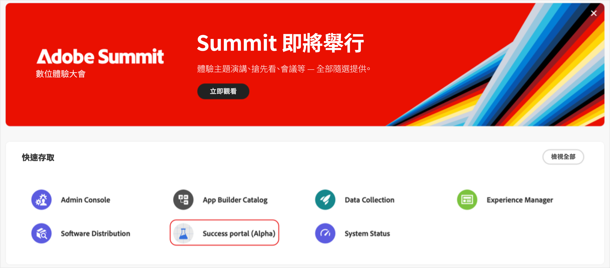
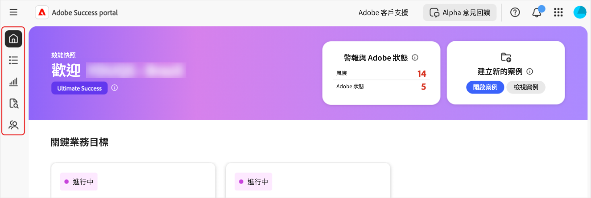

# 存取[!DNL Adobe Success]入口網站

本指南說明如何登入[!DNL Adobe Success]入口網站，並在遇到存取問題時獲得協助。

您將會從&#x200B;**[!UICONTROL 成功]**&#x200B;入口網站團隊收到確認您存取權的通知。 此訊息將包含登入詳細資料。

1. 請前往https://experience.adobe.com/。
1. 使用您的Adobe ID登入。
1. 選取[!DNL Adobe Success]入口網站(Alpha)圖示。

   

1. 登入後，您會看到五個標籤：

   

   * 首頁
   * **[!UICONTROL 行動計畫]**
   * **[!UICONTROL 值追蹤器]**
   * **[!UICONTROL 支援與深入分析]**
   * **[!UICONTROL 支援參與計畫]**

## 疑難排解與支援

如果您在存取入口網站或其功能時遇到問題，請使用[Alpha團隊頻道](https://teams.microsoft.com/l/channel/19:h-GcuAZs9uF05rervqTdx2U27ohYINuRUIfbMte9B-U1@thread.tacv2/General?groupId=02b87789-3475-47e4-94c1-0981f63ae89f&tenantId=fa7b1b5a-7b34-4387-94ae-d2c178decee1)聯絡我們的團隊。   

您可以使用入口網站上的&#x200B;**[!UICONTROL Alpha意見]**&#x200B;按鈕來提交意見。

>[!NOTE]
>
>意見回饋工具並非專屬的支援管道。 不適用於緊急的登入問題。

