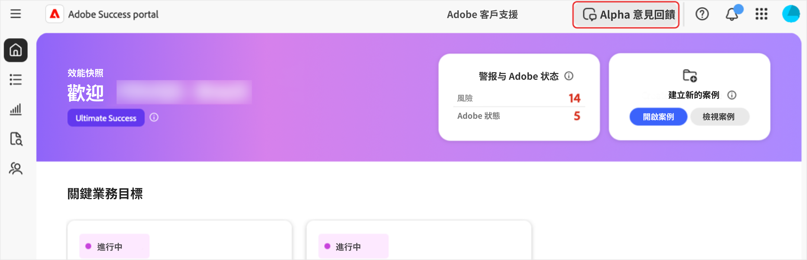

# 存取 [!DNL Adobe Success] 入口網站

此指南說明如何登入 [!DNL Adobe Success] 入口網站，以及如果遇到存取問題時可獲得的協助。

您將收到來自 **[!UICONTROL 成功]** 入口網站團隊的通知，以確認您的存取權限。此訊息將包括登入詳細資料。

1. 前往 [https://experience.adobe.com/](https://experience.adobe.com/)。
1. 使用您的 Adobe ID 登入。
1. 選取「**[!UICONTROL 成功入口網站 (Alpha 版)]**」圖示。

   成功入口網站(Alpha)的")

1. 登入後，您會看到五個索引標籤：

   

   * 首頁
   * **[!UICONTROL 行動計劃]**
   * **[!UICONTROL 價值追蹤器]**
   * **[!UICONTROL 支援與洞察]**
   * **[!UICONTROL 支援參與度計劃]**

## 疑難排解和支援

如果您在存取入口網站或其功能時遇到問題，請使用 [Alpha Teams 管道](https://teams.microsoft.com/l/channel/19:h-GcuAZs9uF05rervqTdx2U27ohYINuRUIfbMte9B-U1@thread.tacv2/General?groupId=02b87789-3475-47e4-94c1-0981f63ae89f&tenantId=fa7b1b5a-7b34-4387-94ae-d2c178decee1)來聯絡我們的團隊。

您可以使用入口網站上的「**[!UICONTROL Alpha 版意見]**」按鈕來提交意見。

>[!NOTE]
>
>意見工具不是專門的支援管道。此工具不適合用於緊急的登入問題。

入口網站上的
