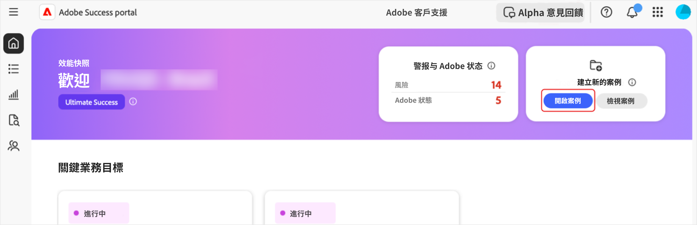
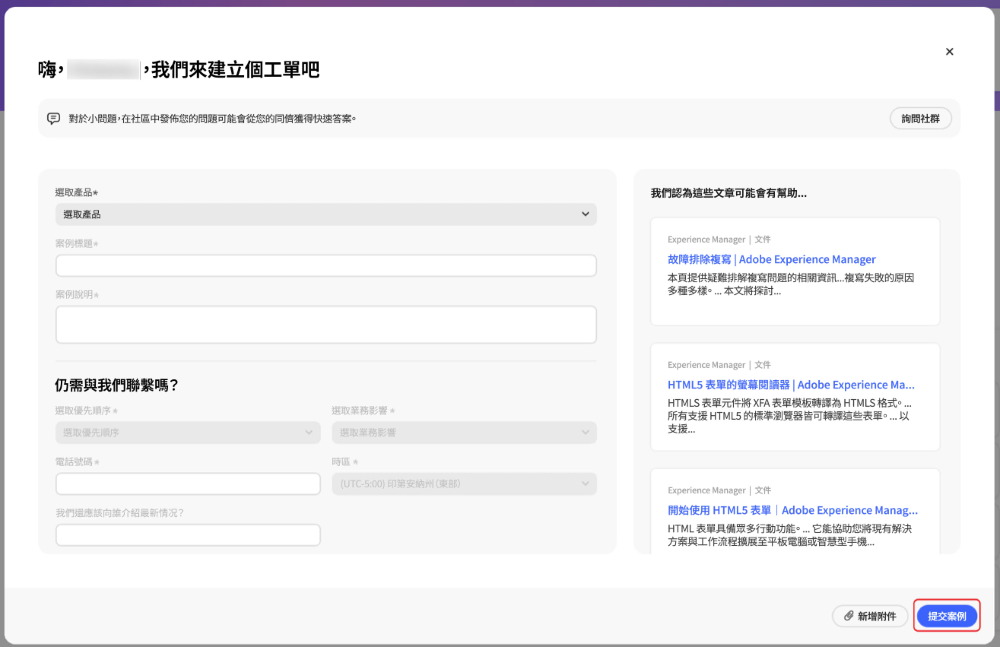
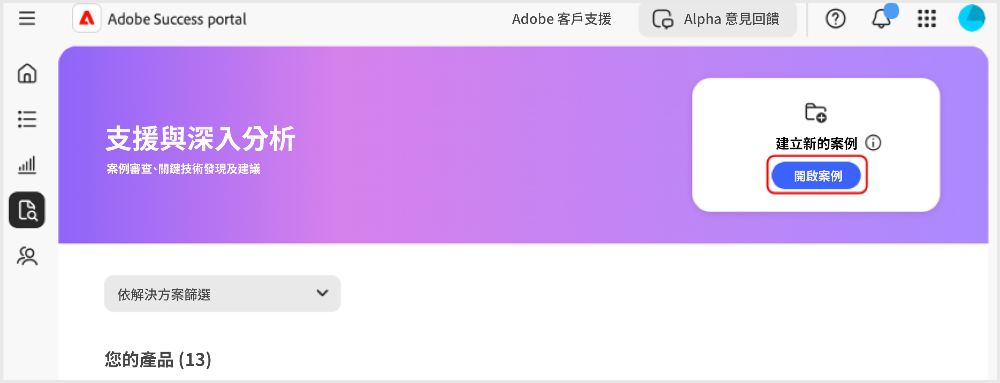
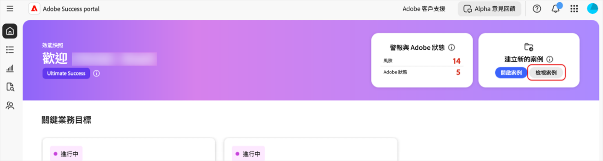
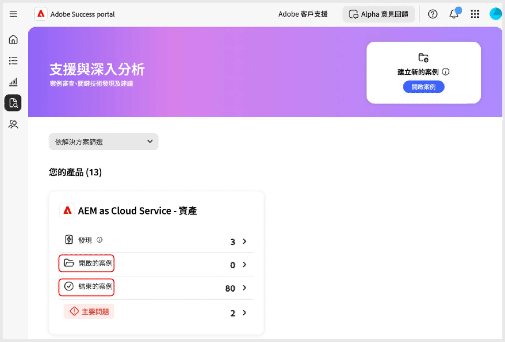
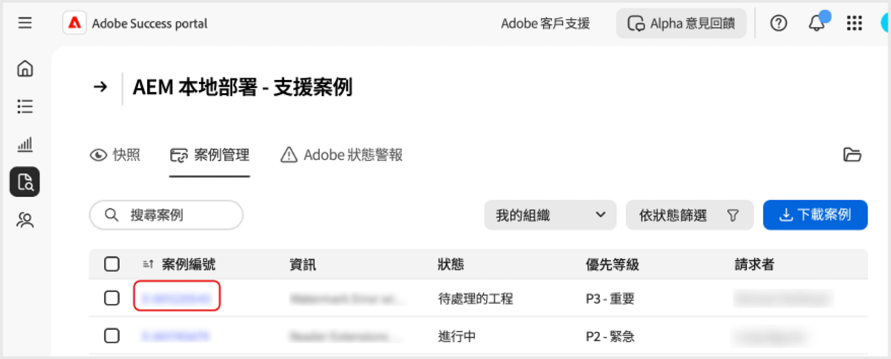
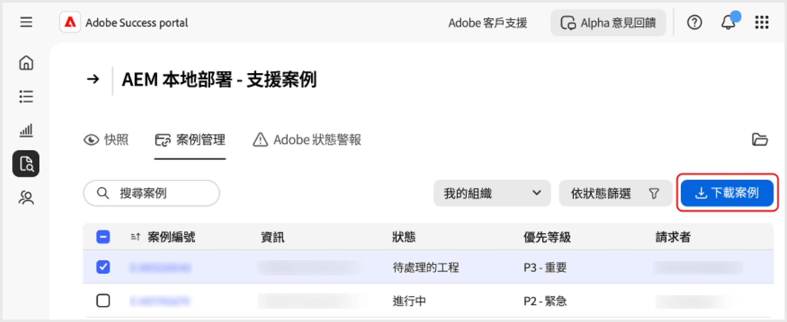

# 在 [!DNL Adobe Success] 入口網站建立和管理案例

本指南說明如何在 [!DNL Adobe Success] 入口網站建立、檢視及下載案例。

## 開啟案例

您可以從首頁索引標籤或「**[!UICONTROL 支援與洞察]**」索引標籤開啟案例。

若要從「首頁」索引標籤存取&#x200B;**[!UICONTROL 未結案例]**&#x200B;頁面：

1. 前往「首頁」索引標籤。
1. 選取&#x200B;**[!UICONTROL 未結案例]**。

   

1. 填寫必要欄位：
   1. **[!UICONTROL 選取產品]**。
   1. **[!UICONTROL 案例標題]**。
   1. **[!UICONTROL 案例說明]**
1. 選取「**[!UICONTROL 提交案例]**」。

   

若要從「**[!UICONTROL 支援與洞察]**」索引標籤存取「**[!UICONTROL 未結案例]**」頁面。

1. 前往「**[!UICONTROL 支援與洞察]**」索引標籤。
1. 選取&#x200B;**[!UICONTROL 未結案例]**。

   

依照上述相同的步驟完成並提交案例。

## 檢視案例

您可以從「首頁」索引標籤或「**[!UICONTROL 支援與洞察]**」索引標籤檢視案例。

若要從「首頁」索引標籤存取「**[!UICONTROL 檢視案例]**」頁面：

1. 前往「首頁」索引標籤。
1. 選取「**[!UICONTROL 檢視案例]**」。

   

1. 選取要檢視的產品卡，然後選擇「**[!UICONTROL 未結案例]**」或者「**[!UICONTROL 已關閉案例]**」。

   >[!NOTE]
   >
   >您也可以選取「**[!UICONTROL 支援與洞察]**」索引標籤，以快速存取包含&#x200B;**[!UICONTROL 未結案例]**&#x200B;或者&#x200B;**[!UICONTROL 已關閉案例]**&#x200B;連結的產品卡。

   

1. 按一下「**[!UICONTROL 案例編號]**」以檢視案例詳情。

   

## 下載案例報告

若要下載案例的 PDF 報告：

1. 瀏覽至「首頁」索引標籤。
1. 選取「**[!UICONTROL 檢視案例]**」。

   

1. 選取要檢視的產品卡，然後選擇「**[!UICONTROL 未結案例]**」或者「**[!UICONTROL 已關閉案例]**」。

   >[!NOTE]
   >
   >您也可以選取「**[!UICONTROL 支援與洞察]**」索引標籤，以快速存取包含&#x200B;**[!UICONTROL 未結案例]**&#x200B;或者&#x200B;**[!UICONTROL 已關閉案例]**&#x200B;連結的產品卡。

   

1. 在 [產品] 上：支援案例頁面，選取要下載的案例旁的核取方塊，並選取「**[!UICONTROL 下載案例]**」。

   
