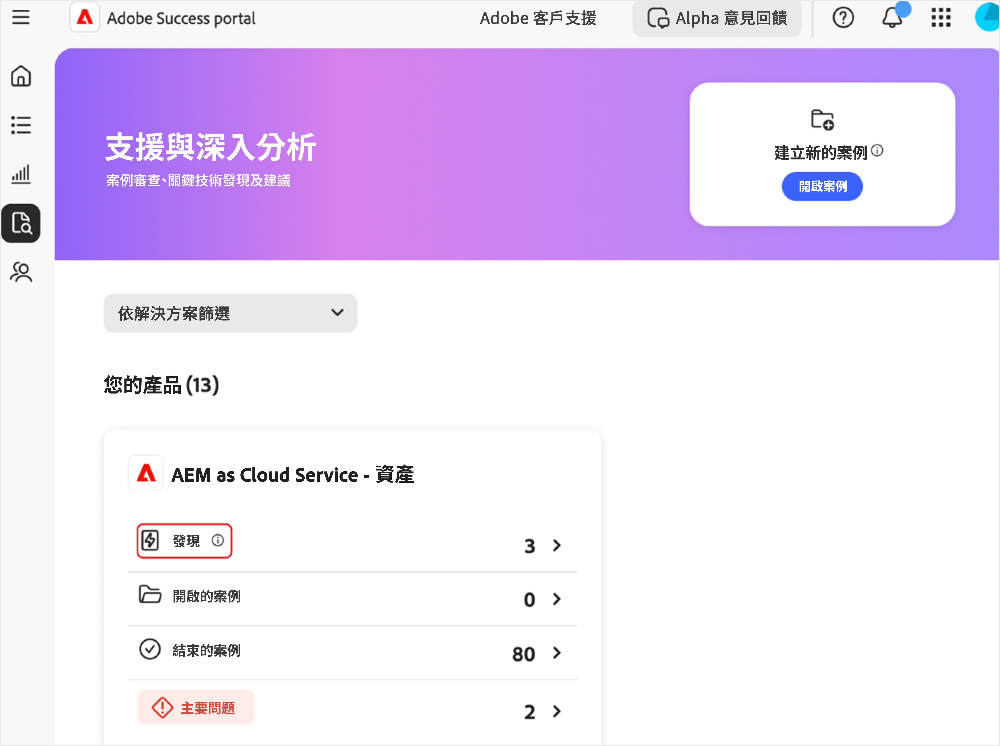
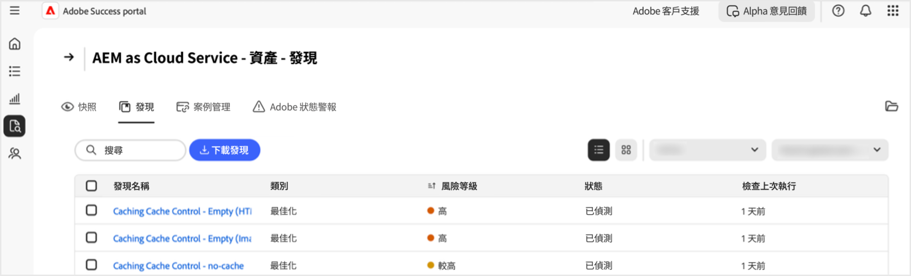
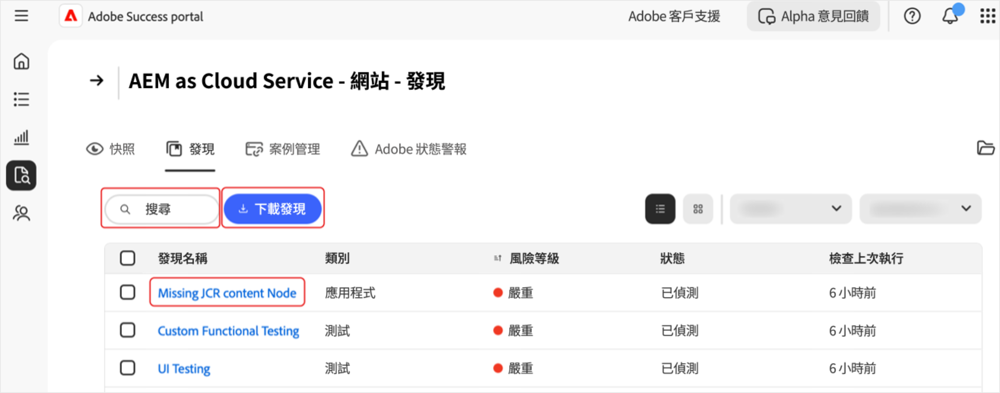
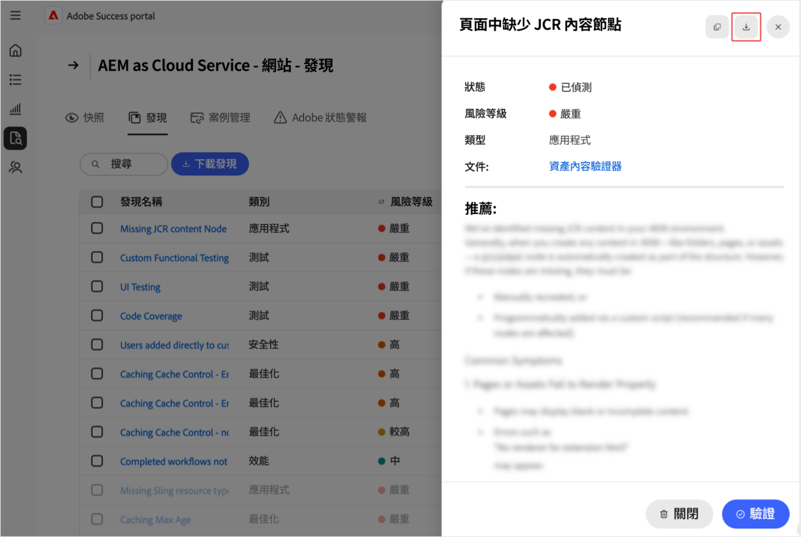
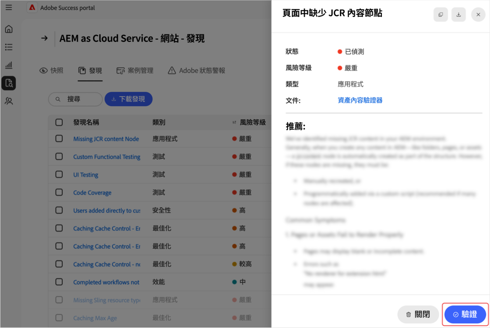

# 管理[!DNL Adobe Success]入口網站中的發現

本指南說明如何存取、解譯和處理[!DNL Adobe Success]入口網站中的發現，協助您主動管理產品效能、安全性和功能風險。

[!DNL Adobe Success]入口網站&#x200B;**[!UICONTROL 發現]**&#x200B;頁面顯示在您的Adobe產品執行個體中偵測到的問題或風險。 調查結果包括效能、安全性和功能問題，以及其狀態和風險等級。 監控此頁面可協助您及早解決問題，以免問題影響您的環境。

**什麼是發現？**

發現是[!DNL Adobe Success]入口網站中顯示的「支援深入分析」警示。 它們會強調您Adobe產品設定中的潛在問題 — 例如效能降低、安全性風險或不正確的設定。 這些警示是根據從API、[!DNL New Relic]和[!DNL Splunk]等工具收集的遙測資料。

**如何建立發現？**

Adobe團隊會定期研究最常見的支援問題和趨勢。 他們根據見解將新檢查新增到系統。 [!DNL Adobe Success]入口網站每天會掃描一次產品資料，以偵測問題，例如設定錯誤、工作停滯或可能導致系統中斷的任何問題。 如果檢查發現安全範圍以外的專案(如Adobe的產品和支援團隊所定義)，則會顯示為發現。

**為什麼發現很重要**

定期檢閱發現有助於及早發現問題，以免影響您的系統或客戶。 此主動式方法可改善系統穩定性、減少停機時間，並支援最佳實務。

**如何修正發現**

每個結果都包含建議及解決問題的明確指示，以及相關檔案的連結（若有）。 請與您的IT、工程團隊或Adobe合作夥伴分享這些發現，並共同努力解決問題。 及早修正這些問題有助於避免發生更大的問題，並維持系統順暢運作。

## 存取發現

若要檢視產品的深入分析：

1. 導覽至&#x200B;**[!UICONTROL 支援與深入分析]**。
1. 選取相關的產品卡。 選取&#x200B;**[!UICONTROL 發現]**&#x200B;標籤。

   

1. 您會看到所選產品的所有發現專案清單。

   

1. 從這裡，您可以：

   

   * 搜尋特定專案。
   * 選取&#x200B;**[!UICONTROL 下載發現]**&#x200B;以匯出發現清單。 若要匯出某個結果的報告，請選取&#x200B;**[!UICONTROL 結果名稱]**&#x200B;欄下相關結果旁邊的核取方塊。 如果您未選取發現專案，PDF預設會包含所有發現專案的清單。
   * 檢視結果的詳細資料，包括在&#x200B;**[!UICONTROL 結果名稱]**&#x200B;下選取結果的建議解析度。 「結果詳細資訊」頁面會顯示選取的結果與其他內容及建議。 若要檢視此報表，請選取下載箭頭。

     

## 動作發現

請依照下列步驟驗證每個發現是否仍然適用或可以解除。

>[!NOTE]
>：
>
>在您的執行個體上執行標準檢查。 如果檢查未發現您的執行個體中存在問題，則狀態為&#x200B;**[!UICONTROL 未偵測到]**。

1. 導覽至&#x200B;**[!UICONTROL 支援與深入分析]**。
1. 選取相關的產品卡。
1. 開啟&#x200B;**[!UICONTROL 發現]**&#x200B;標籤。 您會看到所選產品的所有發現。
1. 在&#x200B;**[!UICONTROL 結果名稱]**&#x200B;下選取專案。 您可以在「發現專案詳細資訊」頁面執行下列作業：
   * 選取「**[!UICONTROL 驗證]**」以檢查問題是否仍然存在（「**[!UICONTROL 驗證]**」按鈕設計成確認問題已解決）：

   

   * 如果問題仍然存在，會顯示下列訊息： *[!UICONTROL 驗證完成。 仍偵測到]*&#x200B;個發現。 使用「發現專案詳細資訊」頁面上的資訊和建議來調查和解決。
   * 如果問題已不存在，則會顯示下列訊息： *[!UICONTROL 驗證完成。 不再偵測到結果]*。 不再偵測到結果時，結果會變灰，狀態會變更為&#x200B;**[!UICONTROL 未偵測到]**。 具有&#x200B;**[!UICONTROL 未偵測到]**&#x200B;狀態的發現專案位於發現專案清單底部。
   * 如果問題不適用或不與您相關，您可以選取&#x200B;**[!UICONTROL 解除]**&#x200B;以將其解除。 當發現專案被關閉時，發現專案會變成灰色，且狀態會變更為&#x200B;**[!UICONTROL 已關閉]**。  具有&#x200B;**[!UICONTROL 已解除]**&#x200B;狀態的發現專案位於發現專案清單底部。

## 瞭解發現

* **[!UICONTROL 尋找名稱]** — 選取以取得詳細的深入分析和建議的解決步驟。
* **[!UICONTROL 型別]** — 分類為&#x200B;*功能*、*效能*&#x200B;和&#x200B;*安全性*。
* **[!UICONTROL 風險等級]** — 嚴重程度指示器，含視覺指示器。
* **[!UICONTROL 狀態]** — 結果的目前狀態（例如，*已偵測*，*未偵測*，*已解除*）。
* **[!UICONTROL 檢查上次執行]** — 更新結果的上次檢查時間戳記。

## 最佳做法

**[!UICONTROL 發現]**&#x200B;頁面列出具有下列風險等級的建議： **[!UICONTROL 高]**、**[!UICONTROL 已提升]**&#x200B;及&#x200B;**[!UICONTROL Medium]**。 **[!UICONTROL 高]**&#x200B;嚴重，**[!UICONTROL 已提升]**&#x200B;緊急，且&#x200B;**[!UICONTROL Medium]**&#x200B;非嚴重。 若要維持網站運作狀況和效能：

* 快速處理&#x200B;**[!UICONTROL 高風險]**&#x200B;發現，因為它們構成嚴重威脅。
* 儘快解決&#x200B;**[!UICONTROL 提升的]**&#x200B;風險問題，以避擴音升。
* 定期監視&#x200B;**[!UICONTROL Medium]**&#x200B;風險發現，並視需要採取行動。

