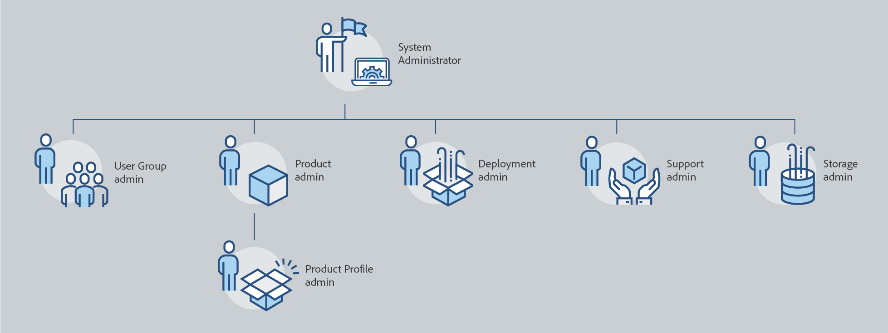
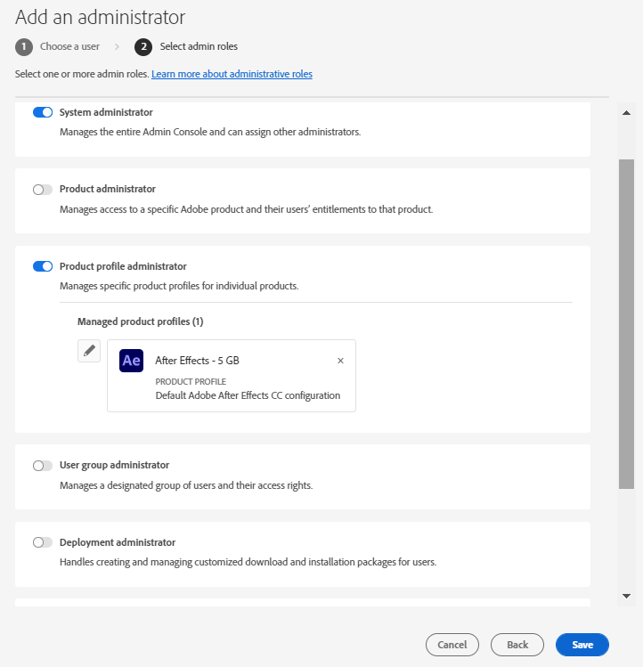
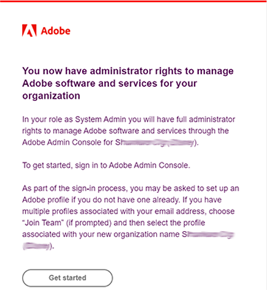
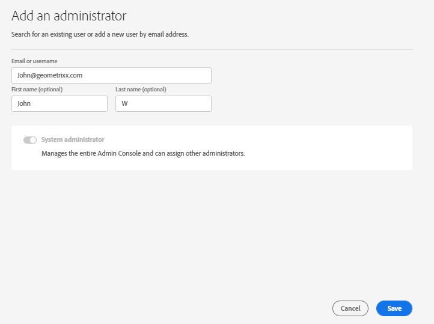
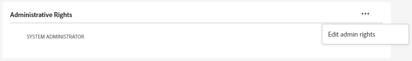
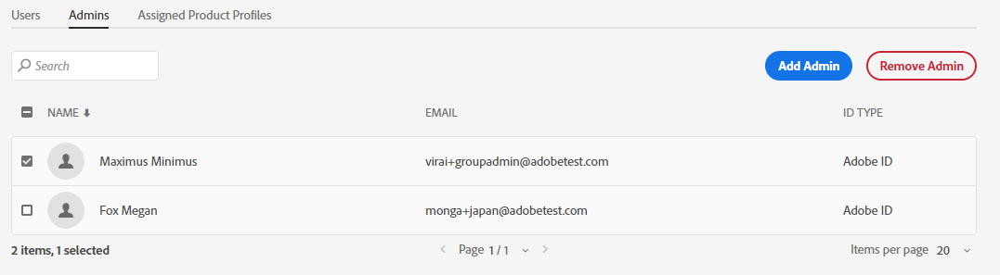

# 管理角色

使用Adobe Admin Console，組織可以定義靈活的管理階層，以更精細地管理Adobe產品的存取及使用。 在企業上線流程中布建的一或多個系統管理員位於階層的頂端。 這些系統管理員可以將責任委派給其他管理員，同時仍保留整體控制權。

管理角色為企業提供下列主要優點：

* 控管分散管理責任
* 產品指派的快速檢視 — 依使用者和依產品
* 指派配額給產品管理員的功能

## 管理階層

套用至： Adobe企業客戶。

您可以使用管理階層來符合企業的獨特需求。 例如，企業可指定不同的管理員來管理Adobe Creative Cloud和Adobe Marketing Cloud產品的權益。 或者，企業可以有不同的管理員來管理屬於不同業務單位之使用者的權益。

>[!NOTE]
>
>管理階層不適用於Teams客戶。 Teams客戶有單一&#x200B;**系統管理員**&#x200B;角色。 合約擁有者（_先前稱為&#x200B;**主要管理員**&#x200B;_）是系統管理員，可存取合約詳細資料和計費記錄。 如果您是目前的合約擁有者，您可以將現有的系統管理員（_&#x200B;先前稱為&#x200B;**次要管理員**&#x200B;_）指派為合約擁有者。

_管理員角色階層_

| 角色 | 說明 |
|--- |--- |
| **系統管理員** | 組織的超級使用者；有權在Admin Console中執行所有管理工作。 此外，具有將下列管理功能委派給其他使用者的許可權：產品管理員、產品設定檔管理員、使用者群組管理員、部署管理員和支援管理員。 |
| **產品管理員** | 管理指派給該管理員的產品及所有相關的管理功能，包括：<ul><li>建立產品設定檔</li><li>將使用者與使用者群組新增至組織，但不會移除這些使用者與使用者群組</li><li>從產品設定檔新增或移除使用者和使用者群組</li><li>從產品設定檔新增或移除產品設定檔管理員</li><li>從產品新增或移除其他產品管理員</li><li>新增或移除群組中的群組管理員</li></ul> |
| **產品設定檔管理員** | 管理指派給該管理員的產品設定檔說明以及所有相關管理功能，包括：<ul><li>將使用者與使用者群組新增至組織，但不會移除這些使用者與使用者群組</li><li>從產品設定檔新增或移除使用者和使用者群組</li><li>從產品設定檔指派或撤銷使用者和使用者群組的產品許可權</li><li>管理產品設定檔的使用者和使用者群組的產品角色 |
| **使用者群組管理員** | 管理指派給該管理員的使用者群組說明以及所有相關的管理功能，包括：<ul><li>新增或移除群組中的使用者</li><li>新增或移除群組中的使用者群組管理員 |
| **部署管理員** | 建立、管理和部署軟體套件和更新給一般使用者。 |
| **支援管理員** | 可存取支援相關資訊（例如客戶回報的問題報告）的非管理角色。 |
| **儲存管理員** | 管理組織的儲存管理。 管理員可以檢視使用中和非使用中使用者的儲存空間消耗，並將內容轉移給其他收件者。 |

如需每個管理員角色的詳細許可權清單，請參閱[許可權](#enterprise-admins-permissions-matrix)。

## 新增企業管理員角色 {#add-enterprise-role}

套用至： Adobe企業客戶。

身為管理員，您可以將管理員角色指派給其他使用者，給予他們與您擁有的相同許可權，或階層中管理員角色下之角色的許可權，如上方[所述](#administrative-hierarchy)。 例如，作為產品管理員，您可以授予使用者產品管理員許可權或產品設定檔管理員許可權，但不能授予部署管理員許可權。 如需Admin Console的許可權，請參閱[許可權矩陣](#enterprise-admins-permissions-matrix)。

若要新增或邀請管理員：

1. 在[Admin Console](https://adminconsole.adobe.com/)中，選擇&#x200B;**使用者** > **系統管理員**。

   或者，前往相關的產品、產品設定檔或使用者群組，然後導覽至&#x200B;**管理員**&#x200B;標籤。

1. 按一下&#x200B;**新增管理員**。
1. 輸入名稱或電子郵件地址。 您可以搜尋現有使用者，或透過指定有效的電子郵件地址並在畫面上填寫資訊來新增使用者。
1. 按一下&#x200B;**下一步**。 管理員角色清單隨即顯示。

>[!NOTE]
>
>* 此畫面上的選項取決於您的帳戶和管理員角色。 您可以賦予與自己相同的許可權，或階層中您所屬之角色的許可權。
>* 身為團隊的系統管理員，您只能指派一個管理員角色：系統管理員。

1. 選取一或多個管理員角色。
1. 對於「產品管理員」、「產品設定檔管理員」和「使用者群組管理員」等管理員型別，請分別選取特定產品、設定檔和群組。

>[!NOTE]
>
>對於產品設定檔管理員，您可以包含多個產品的設定檔。

1. 檢閱指派給使用者的管理員角色，然後按一下[儲存]。**&#x200B;**

使用者會收到來自`message@adobe.com`有關新系統管理許可權的電子郵件邀請。

使用者必須按一下電子郵件中的&#x200B;**開始使用**&#x200B;才能加入組織。 如果新的管理員未使用電子郵件邀請中的&#x200B;**開始使用**&#x200B;連結，他們將無法登入Admin Console。

在登入過程中，如果使用者尚未設定Adobe設定檔，他們可能會被要求設定。 如果使用者有多個與其電子郵件地址相關聯的設定檔，使用者必須選擇「加入團隊」（如果提示），然後選取與新組織相關聯的設定檔。

## 新增團隊管理員 {#add-admin-teams}

套用至： Adobe團隊客戶。

身為管理員，您可以將系統管理員角色指派給其他使用者，給予他們與您相同的許可權。

若要新增或邀請系統管理員：

1. 在Admin Console中，選擇&#x200B;**使用者** > **管理員**。

   此時會顯示現有管理員清單。

1. 按一下&#x200B;**新增管理員**。

   顯示&#x200B;**新增管理員**&#x200B;畫面。

1. 輸入名稱或電子郵件地址。 您可以搜尋現有使用者，或透過指定有效的電子郵件地址並在畫面上填寫資訊來新增使用者。

   依預設，會選取「系統管理員」。

1. 按一下&#x200B;**儲存**。

由於團隊組織中的所有使用者都是Business ID使用者，因此他們會收到來自`message@adobe.com`有關新管理許可權的電子郵件邀請。
使用者必須按一下電子郵件中的「開始使用」才能加入組織。

在登入過程中，如果使用者尚未設定Adobe設定檔，他們可能會被要求設定。 如果使用者有多個與其電子郵件地址相關聯的設定檔，使用者必須選擇「加入團隊」（如果提示），然後選取與新組織相關聯的設定檔。

## 編輯企業管理員角色

套用至： Adobe企業客戶。

身為管理員，您可以編輯管理員角色給在管理階層中位於您之下的其他管理員。 例如，您可以移除其他管理員的管理員許可權。

若要編輯管理員角色：

1. 在Admin Console中，選擇&#x200B;**使用者** > **管理員**。 現有管理員清單隨即顯示。

   或者，前往相關的產品、產品設定檔或使用者群組，然後導覽至&#x200B;**管理員**&#x200B;標籤。

1. 按一下要編輯的管理員名稱。
1. 在&#x200B;**使用者詳細資訊**&#x200B;中，按一下區段的&#x200B;**圖示**，然後選擇&#x200B;**編輯管理許可權**。

   

1. 編輯管理許可權並儲存變更。

## 編輯團隊管理員角色

套用至： Adobe團隊客戶。

作為團隊系統管理員，您可以移除其他管理員的系統管理員許可權。

撤銷系統管理員許可權：

1. 在Admin Console中，選擇&#x200B;**使用者** > **管理員**。

   現有管理員清單隨即顯示。

1. 在[使用者詳細資訊]中，按一下區段右側的&#x200B;**圖示**，然後選擇&#x200B;**編輯管理許可權**。

   

1. 編輯管理許可權並儲存變更。

## 移除管理員

套用至： Adobe會與企業客戶合作。

1. 若要撤銷管理員許可權，請選取使用者，然後按一下[移除管理員]。**&#x200B;**

>[!NOTE]
>
>移除管理員不會從Admin Console中刪除使用者，而只會移除與管理員角色相關聯的許可權。

## Enterprise Admin許可權矩陣

套用至： Adobe企業客戶。

下表列出不同型別管理員的所有許可權，並依下列功能區域分類：

### 身分管理

| 權限 | 系統管理員 | 支援管理員 |
|--- |--- |--- |
| 新增網域（要求/宣告網域） | ✔ | |
| 檢視網域和網域清單 | ✔ | |
| 管理網域加密金鑰 | ✔ | |
| 管理預設組織密碼原則 | ✔ | |
| 檢視預設組織密碼原則 | ✔ | |

### 使用者管理

| 權限 | 系統管理員 | 支援管理員 |
|--- |--- |--- |
| 將使用者新增至組織 | ✔ | |
| 從組織移除使用者 | ✔ | |
| 檢視使用者詳細資料和清單 | ✔ | |
| 編輯使用者設定檔 | ✔ | |
| 新增產品設定檔至使用者或群組 | ✔ | |
| 移除使用者或群組的產品設定檔 | ✔ | |
| 將產品設定檔新增至多位使用者 | ✔ | |
| 檢視使用者的產品設定檔 | ✔ | |
| 檢視產品使用者清單 | ✔ | |
| 將使用者大量新增至組織 | ✔ | |

### 管理員管理

| 權限 | 系統管理員 | 支援管理員 |
|--- |--- |--- |
| 授予使用者組織管理員 | ✔ | |
| 撤銷使用者的組織管理員 | ✔ | |
| 授予使用者產品授權管理員 | ✔ | |
| 撤銷使用者的產品授權管理員 | ✔ | |
| 將部署管理員授予使用者 | ✔ | |
| 撤銷使用者的部署管理員 | ✔ | |
| 授予使用者群組管理員給使用者 | ✔ | |
| 撤銷使用者的使用者群組管理員 | ✔ | |
| 將產品擁有者管理員授予使用者 | ✔ | |
| 撤銷使用者的產品擁有者管理員 | ✔ | |

### 產品授權設定管理

| 權限 | 系統管理員 | 支援管理員 |
|--- |--- |--- |
| 授予組織的產品權利 | | |
| 從組織移除產品權利 | | |
| 檢視組織擁有的授權總數 | ✔ | |
| 檢視可用的產品和產品系列 | ✔ | |
| 編輯產品授權說明/資料 | ✔ | |
| 為使用者布建產品授權 | ✔ | |
| 從使用者取消布建產品授權 | ✔ | |
| 新增產品授權設定 | ✔ | |
| 編輯產品授權服務設定 | ✔ | |
| 刪除產品授權服務設定 | ✔ | |
| 移除使用者的產品存取權（移除所有設定） | ✔ | |

### 儲存空間管理

| 權限 | 系統管理員 | 支援管理員 |
|--- |--- |--- |
| 檢視使用中和非使用中的使用者資料夾 | ✔ | |
| 刪除非作用中的使用者資料夾並轉移內容 | ✔ | |

### 部署

| 權限 | 系統管理員 | 支援管理員 |
|--- |--- |--- |
| 檢視/使用封裝標籤 | ✔ | |

### 支援

| 權限 | 系統管理員 | 支援管理員 |
|--- |--- |--- |
| 檢視支援標籤 | ✔ | |
| 管理支援案例 | ✔ | ✔ |

### 使用者群組管理

| 權限 | 系統管理員 | 支援管理員 |
|--- |--- |--- |
| 建立使用者群組 | ✔ | |
| 移除使用者群組 | ✔ | |
| 新增使用者至使用者群組 | ✔ | |
| 從使用者群組中移除使用者 | ✔ | |
| 將使用者群組指派給產品授權 | ✔ | |
| 從產品授權移除使用者群組 | ✔ | |
| 檢視使用者群組的成員 | ✔ | ✔ |
| 檢視使用者群組清單 | ✔ | ✔ |