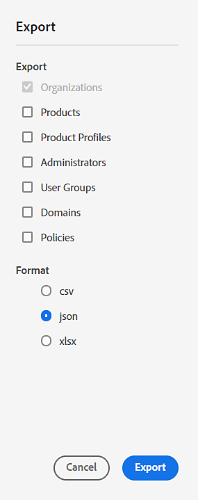

# 匯出或匯入組織結構和產品配置

**套用至：**&#x200B;企業

瞭解全域管理員如何透過Global Admin Console中的匯出和匯入功能簡化組織和產品管理。

存取&#x200B;**[!UICONTROL Global Admin Console]**&#x200B;中的[組織](https://helpx.adobe.com/tw/enterprise/global-admin-console/adopt-global-administration.html)索引標籤，以匯出或匯入組織結構。 前往配置資料的&#x200B;**[!UICONTROL 產品配置]**&#x200B;標籤。 使用&#x200B;**[!UICONTROL 更多選項]** **⋮**&#x200B;圖示來選取匯出或匯入。 [登入Global Admin Console](https://global-admin-console.adobe.com)。

## 匯出組織結構

作為[全域系統管理員](https://helpx.adobe.com/tw/enterprise/global-admin-console/manage-administrators.html)，您可以匯出組織階層。 您可以下載整個組織階層或其子集的JSON、CSV或XLSX表示法。 然後，您可以使用此資料進行分析或修改。

所選的匯出格式會影響匯出資料的結構：

- CSV格式 — 一次只允許匯出一種資料。 以CSV格式匯出產品設定檔時，設定檔和資源會合併到一個表格中。 產品設定檔具有多個專案，每個資源各一個。
- XLSX格式 — 導致每個組織詳細資訊顯示在單獨的頁面中。 記錄會透過參考ID連線在不同物件型別之間。 在某些情況下，特定物件可能會有多列（例如，當有一組與指定資源關聯的值時，為Resource物件）。
- JSON格式 — 最具彈性。 它可以利用匯出物件之間的結構關係（例如，組織中的產品會直接出現在組織元素中）。 相同的欄位會以所有三種格式匯出，但有些值在JSON格式中是多餘的。

### 匯出步驟

1. 登入[Global Admin Console](https://global-admin-console.adobe.com/)。 在&#x200B;**[!UICONTROL 組織]**&#x200B;標籤中，使用組織選擇器來選取您要匯出的組織階層。 會匯出階層中所有組織的資料。
2. 選取&#x200B;**[!UICONTROL 其他選項]**⋮選圖示，然後選擇&#x200B;**[!UICONTROL 匯出]**。

   

3. 在&#x200B;**[!UICONTROL 匯出]**&#x200B;對話方塊中，選取要匯出的內容以及匯出資料的格式。

   

4. 選取&#x200B;**[!UICONTROL 匯出]**。 匯出檔案可能需要幾分鐘的時間才能產生。 完成之後，若要下載報表，請導覽至&#x200B;**[!UICONTROL Global Admin Console]** > **[!UICONTROL 深入分析]** > **[!UICONTROL 匯出報表]**。

>[!NOTE]
>
>JSON檔案會匯出為zip格式。 您可以使用zip公用程式或作業系統的zip功能來開啟它們。

下載檔案後，您可以操作資料，然後將其匯回。 匯入的更新會顯示在Global Admin Console中，就像您已手動編輯資料一樣。

## 匯入組織結構

作為[全域系統管理員](https://helpx.adobe.com/tw/enterprise/global-admin-console/manage-administrators.html)，您可以匯入可能修改過的資料。 上傳後，新資料會與目前資料進行比較，所有變更都會套用至組織階層。 所有匯入作業都會在組織階層的更新復本上執行。 如果您有任何暫止的變更，匯入變更將會新增到階層中暫止變更的頂端。

### 匯入步驟

1. 登入[Global Admin Console](https://global-admin-console.adobe.com)。 在&#x200B;**[!UICONTROL 組織]**&#x200B;標籤中，使用組織選擇器來選取您要執行匯入的組織階層。
2. 選取&#x200B;**[!UICONTROL 其他選項]** **⋮**&#x200B;圖示並選取&#x200B;**[!UICONTROL 匯入]**。 根據匯入檔案的大小和複雜性，處理作業可能需要幾秒鐘到幾分鐘的時間。
3. 選取&#x200B;**[!UICONTROL 選取檔案]**，然後選擇要上傳的JSON、CSV或XLSX檔案。 對於CSV，一次只能匯入一個組織詳細資料，並且不支援匯入產品。 匯入的變更看起來就像您已手動編輯資料。
4. 選取&#x200B;**[!UICONTROL 關閉]**。
5. 選取&#x200B;**[!UICONTROL 檢閱擱置中的變更]**。 然後，選取&#x200B;**[!UICONTROL 提交變更]**&#x200B;以[執行](https://helpx.adobe.com/tw/enterprise/global-admin-console/execute-jobs.html)它們。 在執行變更之前，擱置動作的顯示方式，與在Global Admin Console中手動編輯時相同。

## 匯出和匯入結構描述

使用CSV檔案匯入資料時，欄位可以任何順序出現，但必須始終符合其標頭列。

匯入資料時，您必須為每個元素指定操作。 作業可以是下列任一作業：

- 更新：表示編輯。
- 建立：表示建立新物件（例如，組織、使用者群組或管理員）。
- 刪除：表示刪除物件（例如，組織、使用者群組或管理員）。

會忽略不含或空白作業欄位的輸入記錄。

### 組織

<table>
  <tr>
    <th>欄位名稱</th>
    <th>說明</th>
    <th>附註</th>
  </tr>

<tr>
    <td>id</td>
    <td>
      組織ID。  
      新增組織時，這可以是空白或設定為預留位置識別碼，例如
      new_org_1。 預留位置識別碼可用於其他匯入專案需要參考的情況
      至此組織。 建立後，將會指派實際組織ID並取代所有
      使用預留位置組織id。
    </td>
    <td>當operation=create時，可設為暫存值</td>
  </tr>

<tr>
    <td>名稱</td>
    <td>
      組織簡單名稱。 最小長度4，最大100。
      名稱最多可包含3個位元組的UTF-8字元，
      不支援4位元組字元。
    </td>
    <td>
      當operation=create或operation=update時，可分別設定或更新
    </td>
  </tr>

<tr>
    <td>countryCode</td>
    <td>國家或地區代碼</td>
    <td>
      當operation=create時必須設定，當operation=update時可以更新
    </td>
  </tr>

<tr>
    <td>類型</td>
    <td>組織型別</td>
    <td>唯讀</td>
  </tr>

<tr>
    <td>parentOrgId</td>
    <td>
      上層組織ID。 空白代表根組織。
      更新時，需套用重大限制，包括新父項須位於相同階層且
      擁有組織中現有的產品。
    </td>
    <td>
      當operation=create或operation=update時，可分別設定或更新
    </td>
  </tr>

<tr>
    <td>adminCount</td>
    <td>管理員人數</td>
    <td>唯讀</td>
  </tr>

<tr>
    <td>domaincount</td>
    <td>網域的數量</td>
    <td>唯讀</td>
  </tr>

<tr>
    <td>使用者計數</td>
    <td>使用者人數</td>
    <td>唯讀</td>
  </tr>

<tr>
    <td>usergroupCount</td>
    <td>使用者群組數目</td>
    <td>唯讀</td>
  </tr>

<tr>
    <td>管理員</td>
    <td>代表此組織之管理員的管理員物件集</td>
    <td rowspan="6">
      若未選取匯出，可能會遺失。 它會顯示在XLSX檔案的個別標籤中。
    </td>
  </tr>

<tr>
    <td>網域</td>
    <td>代表此組織中網域的一組網域物件</td>
  </tr>

<tr>
    <td>產品</td>
    <td>代表此組織中產品的一組產品物件</td>
  </tr>

<tr>
    <td>產品設定檔</td>
    <td>代表此組織中產品設定檔的一組產品設定檔物件</td>
  </tr>

<tr>
    <td>使用者群組</td>
    <td>代表此組織中使用者群組的一組使用者群組物件</td>
  </tr>

<tr>
    <td>orgPolicies</td>
    <td>代表原則及其值的結構</td>
  </tr>

<tr>
    <td>操作</td>
    <td>
      「建立」、「更新」或「刪除」其中之一。 匯入資料時要採取的動作。
    </td>
    <td>匯出時一律空白。</td>
  </tr>
</table>

**匯入需求：**

- 對於更新或刪除，orgId必須參照階層中的現有組織。
- 如果您要建立新組織，可以將orgId欄位保留空白，或將其設定為您可組成的唯一id （例如new-1或new-2）。 此提供的ID可用來指稱要建立的組織。
- 國家/地區代碼應有效。
- *更新*&#x200B;和&#x200B;*刪除*&#x200B;作業的orgId應該已存在於組織階層中。
- 標示為&#x200B;*Delete*&#x200B;的orgId不應選取為具有&#x200B;*Update*&#x200B;或&#x200B;*Create*&#x200B;作業的組織的parentOrgId。
- 位於相同層次和相同父項的子組織不應有相同的orgNames。
- 若要建立組織或更新組織名稱，組織的名稱不得與相同父系的現有子系名稱相符。

### 管理員

<table>
  <tr>
    <th>欄位名稱</th>
    <th>說明</th>
    <th>使用</th>
  </tr>

<tr>
    <td>orgId</td>
    <td>管理員所在組織的參考。</td>
    <td>用來作為尋找包含或關聯物件的參考。</td>
  </tr>

<tr>
    <td>名字</td>
    <td>
     管理員使用者名字。
使用者接受邀請時，Adobe ID使用者的名字和姓氏可能會取代為使用者提供的值。
    </td>
    <td rowspan="4">
      當operation=create或operation=update時，可分別設定或更新
    </td>
  </tr>

<tr>
    <td>姓氏</td>
    <td>管理員使用者姓氏</td>
  </tr>

<tr>
    <td>電子郵件</td>
    <td>管理員使用者電子郵件地址。 這是使用者的主索引鍵，且必須是唯一的。</td>
  </tr>

<tr>
    <td>countryCode</td>
    <td>
使用者操作所在的國家或地區代碼。 僅適用於Federated與Enterprise ID型別。
    </td>
  </tr>

<tr>
    <td>userType</td>
    <td>Adobe ID、Enterprise ID或Federated ID其中之一。</td>
    <td>唯讀</td>
  </tr>

<tr>
    <td>adminType</td>
    <td>全域管理員、全域檢視器、系統管理員、使用者群組管理員、產品管理員、產品設定檔管理員、部署管理員和儲存空間管理員之一。</td>
    <td rowspan="5">當operation=Create時可以設定</td>
  </tr>

<tr>
    <td>groupId</td>
    <td>此使用者為其管理員之群組的群組ID。 僅與使用者群組和產品設定檔管理員相關。</td>

</tr>

<tr>
    <td>licenseId</td>
    <td>此使用者為其管理員之產品的產品授權ID。 僅與產品管理員相關。</td>

</tr>

<tr>
    <td>網域</td>
    <td>未使用電子郵件網域時的使用者網域名稱</td>

</tr>

<tr>
    <td>userName</td>
    <td>如果未使用電子郵件地址，則為使用者的使用者名稱</td>
  </tr>

<tr>
    <td>操作</td>
    <td>「建立」、「更新」或「刪除」其中之一。 匯入資料時要採取的動作。</td>
    <td></td>
  </tr>
</table>

**匯入需求：**

- orgId、email、adminType和userType必須包含有效值。
- countryCode必須有效。
- 如果使用者已存在且正在更新，則userType必須符合使用者。
- 檢查組織中是否有重複的電子郵件地址。

### 產品設定檔

產品設定檔的匯出和匯入包含兩個部分：產品設定檔詳細資料以及一組與產品設定檔相關聯的資源。 這些資源會識別可設定的服務，通常只是為了啟用或停用它們。

- 資源物件會以JSON格式巢狀內嵌於產品設定檔中。
- 將CSV或XLSX與產品設定檔搭配使用時，設定檔和資源會合併到一個表格中。 產品設定檔會有多個專案，每個資源各一個。
- 資源中選取的欄位可控制服務是否已啟用。
- 匯入產品設定檔時，產品設定檔本身以及任何要更新或建立的資源物件上都必須有「建立」或「更新」作業。

<table>
  <tr>
    <th>欄位名稱</th>
    <th>說明</th>
    <th>使用</th>
  </tr>

<tr>
    <td>productProfileId</td>
    <td>
       
      產品設定檔的識別碼
預留位置值可在建立時使用，讓其他物件可參照新的設定檔。
    </td>
    <td>當operation=create時，可設為暫存值</td>
  </tr>

<tr>
    <td>productProfileName</td>
    <td>
     產品描述檔名稱。 它不能與相同組織中的其他產品設定檔或使用者群組重複。
    </td>
    <td rowspan="2">
   當operation=create或operation=update時，可分別設定或更新
    </td>
  </tr>

<tr>
    <td>productProfileDescription</td>
    <td>產品設定檔的文字說明</td>
  </tr>

<tr>
    <td>licenseId</td>
    <td>產品的授權識別碼參考</td>
    <td rowspan="2"> 用作尋找包含或關聯物件的參考
    </td>
  </tr>

<tr>
    <td>orgId</td>
    <td>
包含使用者群組的組織
    </td>
  </tr>

<tr>
    <td>通知</td>
    <td>True或False可指示在使用者新增或從此產品設定檔移除時，是否應該傳送電子郵件通知給使用者</td>
    <td>當operation=create或operation=update時，可分別設定或更新</td>
  </tr>

<tr>
    <td>資源</td>
    <td> 與此產品設定檔相關聯的資源陣列。
此資源欄位僅適用於JSON格式。 對於CSV和XLSX格式，資源由以下附加欄位表示：resourceName、resourceId、resourceDescription、icon、selected、quota、resourceType。 如需這些欄位的詳細資訊，請參閱標題為*產品和資源*的區段。
如果產品設定檔有多個資源，則會有多個資料列，每個資源各一個。 其他欄位會有每個資源的相同值。 </td>
    <td></td>
  </tr>

<tr>
    <td>操作</td>
    <td>「建立」、「更新」或「刪除」其中之一。 匯入資料時要採取的動作。</td>  
    <td></td>
  </tr>
</table>

**匯入需求：**

- productProfileId、licenseId和orgId必須具有有效值。
- 建立產品設定檔時，productProfileName必須是有效的名稱，且不得與相同組織中的其他產品設定檔名稱或使用者群組名稱重複。
- 配額欄位必須具有單位型別的有效值。 當resourceType=QUOTA或空白時，這是數值或無限制。
- 通知欄位必須為true或false。
- 針對CSV和XLSX匯入，請驗證productProfileId；其所有專案都必須有相同的orgId、licenseId和productProfileName。
- 驗證輸入檔案和組織中的重複productProfileName。
- 要更新和刪除的設定檔必須存在於組織中。
- 要更新和刪除（已停用）的資源必須存在於設定檔中。
- 對於要建立的設定檔，請確保：
   - orgId應為新組織或現有組織。
   - licenseId應為新產品或現有產品。
   - 驗證設定檔的資源。

### 產品設定檔中的資源

<table>
  <tr>
    <th>欄位名稱</th>
    <th>說明</th>
    <th>使用</th>
  </tr>

<tr>
    <td>resourceName</td>
    <td>資源的名稱</td>
    <td>唯讀</td>
  </tr>

<tr>
    <td>resourceId</td>
    <td>資源的識別碼</td>
    <td>唯讀</td>
  </tr>

<tr>
    <td>resourceDescription</td>
    <td>資源的文字說明</td>
    <td>唯讀</td>
  </tr>

<tr>
    <td>圖示</td>
    <td>資源影像的URL</td>
    <td>唯讀</td>
  </tr>

<tr>
    <td>已選取</td>
    <td>
      對於組態專案，此功能是否已啟用。
      此欄位僅存在於JSON中。
    </td>
    <td rowspan="2">
      當operation=create或operation=update時，可分別設定或更新。
    </td>
  </tr>

<tr>
    <td>配額</td>
    <td>
      可透過此產品設定檔提供給使用者的主要資源數量。
      此欄位僅存在於JSON中。
    </td>
  </tr>

<tr>
    <td>resourceType</td>
    <td>
      如果存在，則值為SERVICE。 這表示此資源代表服務，可以
      啟用或停用（根據所選欄位的值）。
      此欄位僅存在於JSON中。
    </td>
    <td>唯讀</td>
  </tr>

<tr>
    <td>操作</td>
    <td>
      「建立」、「更新」或「刪除」其中之一。 匯入資料時要採取的動作。
    </td>
    <td></td>
  </tr>
</table>

**匯入需求：**

- 當資源所屬的產品設定檔具有設定為&#x200B;*Delete*&#x200B;或&#x200B;*Create*&#x200B;的作業時，會忽略資源上的作業欄位。
- 不應將任何資源標示為刪除；這是無效的作業。
- 對於要建立的產品設定檔，資源數量應該與來源產品設定檔的資源數量相符。
- 對於具有&#x200B;*更新*&#x200B;操作的資源，該資源必須存在於產品設定檔中。

### 使用者群組

<table>
  <tr>
    <th>欄位名稱</th>
    <th>說明</th>
    <th>使用</th>
  </tr>

<tr>
    <td>userGroupId</td>
    <td>
      使用者群組的識別碼。 可在建立時使用預留位置值，以便
      其他物件可參照新的使用者群組。
    </td>
    <td>當operation=create時，可設為暫存值</td>
  </tr>

<tr>
    <td>userGroupName</td>
    <td>使用者群組的名稱</td>
    <td rowspan="2">
      當operation=create或operation=update時，可分別設定或更新。
    </td>
  </tr>

<tr>
    <td>userGroupDescription</td>
    <td>使用者群組的文字說明</td>
  </tr>

<tr>
    <td>使用者計數</td>
    <td>使用者群組中的使用者數</td>
    <td>唯讀</td>
  </tr>

<tr>
    <td>輪廓</td>
    <td>
      與使用者群組相關聯的產品設定檔ID陣列。
      XLSX的每個值會有一列，其他欄位的值會相同。
    </td>
    <td>
      當operation=create或operation=update時，可分別設定或更新。
    </td>
  </tr>

<tr>
    <td>orgId</td>
    <td>包含使用者群組的組織</td>
    <td>用作尋找包含或關聯物件的參考</td>
  </tr>

<tr>
    <td>操作</td>
    <td>
      「建立」、「更新」或「刪除」其中之一。 匯入資料時要採取的動作。
    </td>
    <td></td>
  </tr>
</table>

**匯入需求：**

- orgId必須參照現有的組織，或是在相同匯入中建立的組織。
- userGroupId必須參考現有的群組以進行更新或刪除，而且可以是您為新使用者群組定義的id。
- 對於更新或建立，userGroupName不得為空白，且不得與相同組織中的其他使用者群組或產品設定檔名稱重複。
- 確定userGroupName在輸入檔案和組織中沒有重複。
- 要更新和刪除的userGroups必須存在於組織中。
- 要從使用者群組移除的設定檔必須存在於使用者群組中。 無法在使用者群組的設定檔上執行更新操作。
- 對於要建立的使用者群組，請確定以下事項：
   - orgId應為新組織或現有組織。
   - 該licenseId （如果適用）應為新產品或現有產品。
   - productProfileId應為新的產品設定檔或現有的產品設定檔。

### 網域

網域資訊提供每個組織中可用網域的唯讀資訊。 此資料不可編輯。

| 欄位名稱 | 說明 | 使用 |
| ------------- | ----------------------------------------------------------------------------------------- | ------------------------------------------------------------- |
| orgId | 列出此網域的組織的參考 | 用來作為尋找包含或關聯物件的參考。 |
| domainName | 網域名稱（例如，adobe.com）。 | 唯讀 |
| directoryname | 列出網域的目錄名稱 | 唯讀 |
| directorype | Federated ID或Enterprise ID其中之一。 | 唯讀 |
| domainstatus | 使用中、保留、無人認領、已申請、已驗證、已撤銷、已過期其中之一。 | 唯讀 |

### 產品和資源 {#products-and-resources}

在XLSX檔案中，有兩個工作表 — 一個用於產品，另一個用於資源。 在JSON中，資源物件會巢狀內嵌於產品物件中。

**產品**

| 欄位名稱 | 說明 | 使用 |
| ------------------- | --------------------------------------------------------------------------------------------------------------------------------------------------------------------------------------------------------------------------------------------------------------------------------------------------------------------------------- | ----------------------------------------------------------------------------- |
| licenseId | 識別產品的ID。 每個產品在列出它的組織中都有唯一的授權ID。 新增新產品時，這會顯示空白或使用預留位置識別碼（例如new_product_1）。 建立之後，會指派實際許可證ID來取代預留位置許可證ID的所有使用。 | 當operation=create時，可設為暫存值 |
| 產品名稱 | 產品名稱 | 唯讀 |
| 產品說明 | 產品的文字說明 | 唯讀 |
| allowOverallation | 表示是否允許此產品執行個體過度配置的布林值。 超量配置是指授予給子組織的數量超過您獲授數量的能力。 | 當operation=create或operation=update時，可分別設定或更新 |
| 圖示 | 產品圖示的URL | 唯讀 |
| sourceLicenseId | 組織中此產品配置來源的產品執行個體的授權識別碼。 如果此執行個體不是配置產品，而是購買產品，則值為Null。 | 當operation=Create時可以設定 |
| productId | 產品的識別碼。 | 唯讀 |
| orgId | 包含此產品例項的組織的識別碼 | 用作尋找包含或關聯物件的參考 |
| 可轉散發的 | 表示此產品是否有可授與給子組織的資源的布林值。 | 唯讀 |
| 資源 | 包含一組資源物件的物件，代表此產品中的資源和設定 |                                                                               |
| 操作 | 「建立」、「更新」或「刪除」其中之一。 匯入資料時要採取的動作。 |                                                                               |

**匯入需求：**

- 對於create，licenseId必須是您建立的唯一id。
- 對於更新，licenseId必須是指定組織中現有產品的識別碼。
- orgId必須參照現有的組織，或是相同匯入作業中正在建立的組織。
- 對於create，sourceLicenseId必須參照現有的產品，或您為相同匯入作業中建立的產品定義的ID。
- licenseId和sourceLicenseId對於具有&#x200B;*Create*&#x200B;作業的產品不應相同。
- 驗證產品的組織；組織應為新的組織，或應已存在於組織階層中。
- 針對&#x200B;*更新*&#x200B;和&#x200B;*刪除*&#x200B;作業，產品應該已存在於組織階層中。
- 標示為&#x200B;*Delete*&#x200B;的licenseId不應做為具有&#x200B;*Create*&#x200B;和&#x200B;*Update*&#x200B;作業的產品的sourceLicenseId。
- 對於具有&#x200B;*Create*&#x200B;作業的產品，請驗證sourceLicenseId是否應該存在於父級組織中。

產品的&#x200B;**資源**

資源物件可出現在產品和產品設定檔中。

| 欄位名稱 | 說明 | 使用 |
| ------------------- | -------------------------------------------------------------------------------------------------------------------------------------------------------------------------------------------------------------- | ----------------------------------------------------------------------------- |
| resourceName | 資源的名稱 | 唯讀 |
| resourceId | 資源的識別碼 | 唯讀 |
| resourceDescription | 資源的文字說明 | 唯讀 |
| 圖示 | 資源影像的URL | 唯讀 |
| 產品名稱 | 此資源所屬的產品名稱。 | 唯讀 |
| licenseId | 此資源所屬產品的授權ID （產品例項）。 | 用作尋找包含或關聯物件的參考 |
| grantedQuantity | 此資源的授權數量：此組織可用於本機或配置給下階組織的資源數量。 | 當operation=create或operation=update時，可分別設定或更新 |
| 單位 | 授權數量的單位名稱。 | 唯讀 |
| currentquantity | 此組織中目前的可用數量。 這是grantedQuantity減去配置給子組織的資源。 此值會顯示在此產品/資源的Admin Console中。 | 唯讀 |
| provisionquantity | 實際布建的數量：可以小於授權或目前，如果存在某些限制，可以小於currentQuantity。 | 唯讀 |
| 操作 | 「建立」、「更新」或「刪除」其中之一。 匯入資料時要採取的動作。 |                                                                               |

**匯入需求：**

當資源所屬的產品具有設定為&#x200B;*Delete*&#x200B;或&#x200B;*Create*&#x200B;的作業時，會忽略資源上的作業欄位。
- 不應將任何資源標示為刪除；這是無效的作業。
- 對於要建立的產品，資源數量應與來源產品的資源數量相符。
- 對於具有&#x200B;*更新*&#x200B;作業的資源，該資源必須存在於產品中。

## 匯入和匯出產品配置資料

作為[全域管理員](https://helpx.adobe.com/tw/enterprise/global-admin-console/manage-administrators.html)，您可以將產品配置資料匯出為JSON或CSV檔案。 然後，您可以操作此資料並將其上傳回以匯入變更。 上傳可能修改的資料後，新資料會與目前資料進行比較，所有變更都會套用至產品配置資料。 然後，您可以檢閱並提交待處理的變更，以使變更生效。

## 匯出產品配置模型

若要匯出產品配置模型，請執行下列動作：

1. 登入[Global Admin Console](https://global-admin-console.adobe.com/)並導覽至&#x200B;**[!UICONTROL 產品配置]**&#x200B;標籤。
2. 選取「**[!UICONTROL 更多選項]**」⋮圖示，然後選取「**[!UICONTROL 匯出CSV]**」或「**[!UICONTROL 匯出JSON]**」。 您的檔案已下載。 [進一步瞭解](#export-and-import-formats-for-product-allocation)匯出格式。

## 匯入產品配置模型

您可以匯出資料、修改資料，然後匯入修改的檔案。 若要匯入產品配置模型，請執行下列動作：

1. 登入[Global Admin Console](https://global-admin-console.adobe.com/)並導覽至&#x200B;**[!UICONTROL 產品配置]**&#x200B;標籤。
2. 選取&#x200B;**[!UICONTROL 其他選項]**⋮圖示並選取&#x200B;**[!UICONTROL 匯入]**。
3. 選取要上傳的JSON或CSV檔案。
4. 選取&#x200B;**[!UICONTROL 檢閱擱置中的變更]**。 檢閱變更後，選取&#x200B;**[!UICONTROL 提交變更]**&#x200B;以[執行](https://helpx.adobe.com/tw/enterprise/global-admin-console/execute-jobs.html)它們。

## 匯出和匯入產品配置的格式

匯出和匯入格式相同。 以CSV格式匯入時，欄位可以任何順序出現，但必須符合標題列。 以JSON格式匯入時，欄位可依任何順序顯示。

匯入產品配置資料時，必須指定作業。 作業可以是下列其中一項：

- 更新：表示編輯（變更grantedQuantity、allowOverAllocation值）。
- 建立：表示將產品資源新增至指定的組織。
- 刪除：表示刪除產品。

如果未指定任何操作，則以CSV或JSON的物件匯入該列的資料時，不會發生任何變更。

在匯出的檔案中，每個產品資源都有一個資料列或記錄。 有些產品有多個資源。

如果產品有多個資源，則「更新」作業可套用至獨立資源，「刪除」作業會刪除產品（包含組織中的所有資源），而「建立」作業則需要匯入檔案中每個資源的記錄，以便指定每個資源的適當數量。 allowOverAllocation欄位是產品範圍，因此此欄位更新所在的資源並不重要。

### 標題的說明

| 欄位名稱 | 說明 | 使用 |
| --------------------- | -------------------------------------------------------------------------------------------------------------------------------------------------------------------------------------------------------------------------------------------------------------------------------------------------------------------------------------------------------------------------------------------------------- | -------------------------------------------------------- |
| 產品名稱 | 產品的名稱。 | 唯讀 |
| licenseId | 產品ID （組織中產品所獨有）。 新增產品時，此值可為空白或設為預留位置識別碼（例如，new_product_1）。 預留位置識別碼可用於其他匯入專案需要參考此產品的情況下。 建立之後，將會指派實際許可證ID並取代預留位置許可證ID的所有使用。 | 當operation=Create時可以設定 |
| sourceLicenseId | 上層產品的ID。 如果代表購買而非配置，則為空白或為Null。 | 當operation=Create時可以設定 |
| productId | 識別此產品類別的ID。 此ID會在相同型別的產品之間共用，且與識別此產品執行個體的licenseId不同。 | 唯讀 |
| resourceName | 此產品資源的名稱。 例如，使用者授權。 | 唯讀 |
| resourceId | 識別此產品資源的ID。 | 當operation=Create時可以設定 |
| orgPathName | 此產品資源所在組織的路徑名稱。 以「/」分隔的區段。 | 唯讀 |
| orgName | 包含此產品資源的組織的簡單名稱。 這是orgPathName的最後一個區段。 | 唯讀 |
| orgId | 包含此產品資源的組織的組織ID。 | 當operation=Create時可以設定 |
| grantedQuantity | 此組織的上階授予的資源數量單位數，或如果產品資源專案代表購買，則為購買的金額。 此欄位可更新，但全域管理員無權變更的已購買產品或根配置除外。 | 當operation=Update或operation=Create時可以更新 |
| 單位 | 資源單位的名稱。 例如，使用者。 | 唯讀 |
| totalAllations | 此組織針對此產品資源授予給子組織的總和。 此值包括對直接子項的直接授予，以及來自這些組織的過度配置。 例如，如果這個組織授與子項10，而子項接著配置其子項25，則totalAllocations會是25：授與子項的10，加上該子項超額的15。 | 唯讀 |
| grantOverage | totalAllocations超過grantedQuantity的金額。 如果totalAllocations未超過grantedQuantity，則此值為Null或零。 | 唯讀 |
| localLicensedQuantity | 在扣除配置給子項的數量後，此組織留出供其使用的資源數量。 這是顯示在Admin Console中的可用數量。 此值可以是零，但絕不為負，即使此組織過度配置資源給其子系。 | 唯讀 |
| localusage | 此組織中使用的資源單位數。 例如，將使用者授權委派給使用者將計為1個使用單位。 | 唯讀 |
| totalUsage | 此組織和所有子項使用的資源單位數。 這顯示此資源在以此組織為根的組織階層部分中的使用狀況。 | 唯讀 |
| useOverage | 組織授權的總使用量（組織和子項已使用比可用更多的資源）。 當totalUsage超過localLicensedQuantity時，這會顯示非零的值。 | 唯讀 |
| allowOverAllocation | 指示是否允許使用者在已無可授予的情況下授予更多資源給子項（儘管授予超額，仍允許授予）。 此值適用於此產品的所有資源。 如果嘗試將相同產品的多個資源的allowOverallocation更新為不同的值，則結果為隨機的。 | 當operation=Update時可以更新 |
| isPurchasedProduct | 如果產品是購買產品（未由父項配置），則為true。 這等同於具有空值的sourceLicenseId。 | 唯讀 |
| 可轉散發的 | 如果產品可配置給子系，則為true，false表示產品僅可在顯示產品的組織中使用，且資源無法配置給其他組織。 | 唯讀 |
| 操作 | 「建立」、「更新」或「刪除」其中之一。 匯入資料時要採取的動作。 |                                                          |

**匯入需求**

**資料驗證**

- 作業欄位必須具有有效的作業。
- 產品匯入資料必須具有必要欄位的屬性和值。
- 產品匯入資料屬性的型別必須正確。
- 不得為不同資源提供產品原則欄位(overAllocation)。
- grantedQuantity欄位：
   - 無法變更為&#x200B;*unlimited* （如果尚未變更為&#x200B;*unlimited*）。
   - 必須是非負數整數或字串值&#x200B;*無限制。*

**許可權/可存取的驗證**

- 與匯入資料關聯的組織必須存在。 如果您要更新，請確定與匯入資料相關聯的產品和資源確實存在。

**新增產品驗證**

- SourceLicenseId必須存在。
- 與新產品相關聯的組織必須存在。
- 正在建立的產品不得存在（具有相同licenseId的產品）。
- 與正在建立之產品相關聯的資源必須具有符合該產品的productId。
