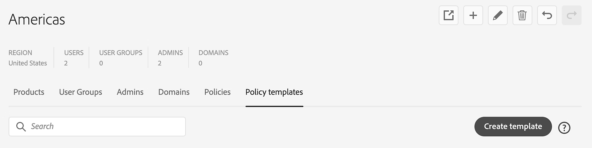

# 在Global Admin Console中管理原則範本

**套用至：**&#x200B;企業

瞭解全域管理員如何直接從存放在Global Admin Console中的組織將原則範本套用至任何子組織。

>[!NOTE]
>
>在[Global Admin Console](https://helpx.adobe.com/enterprise/global-admin-console/adopt-global-administration.html)中，選取要編輯的組織，並導覽至&#x200B;**原則範本**&#x200B;索引標籤，以簡化設定，並促進跨組織的一致原則管理。
>
> [登入Global Admin Console](https://global-admin-console.adobe.com/)

## 原則範本的運作方式

原則範本會與組織一起儲存，並且該組織的所有全域管理員都可以看到。 套用後，原則範本中的專案即會在每個組織中個別設定。 將原則範本套用至組織時，原則範本中的每個專案都會套用至組織的原則，取代現有的原則值。

### 鎖定的原則行為

只有當套用更新的使用者是由要更新之原則的&#x200B;**[!UICONTROL 鎖定者]**&#x200B;圖示所指示之組織的全域管理員時，才會執行鎖定原則的更新。

如果套用範本的使用者有權解鎖原則，則原則鎖定會取得套用範本的值（已鎖定或已解鎖）。 如果範本指出鎖定應該保持原樣，原則中鎖定的值會與之前相同。

### 儲存時的重要注意事項

>[!NOTE]
>
>與Global Admin Console中進行的其他變更不同，對原則範本的編輯會立即生效，不需要經過&#x200B;**[!UICONTROL 檢閱擱置的變更 — 提交]**&#x200B;程式。 不過，若要在套用原則範本的組織中實作暫止的變更，需要[提交](https://helpx.adobe.com/enterprise/global-admin-console/execute-jobs.html)。

## 建立原則範本

1. 在[Global Admin Console](https://global-admin-console.adobe.com/)中，選取要編輯的組織，然後導覽至&#x200B;**[!UICONTROL 原則範本]**&#x200B;索引標籤。
1. 選取&#x200B;**[!UICONTROL 建立範本]**. 
   
    
1. 在&#x200B;**[!UICONTROL 建立原則範本]**&#x200B;對話方塊中，輸入原則範本的&#x200B;**名稱**&#x200B;和&#x200B;**描述**。 原則範本的名稱最多可為100個字元。
1. 選取要包含在範本中的原則。
1. 為選取的原則設定值（請參閱下面的[設定原則值](#setting-policy-values)）。
1. 選取&#x200B;**[!UICONTROL 「儲存」]**。

### 設定原則值 {#setting-policy-values}

針對範本中包含的每個原則，設定兩個設定：

* **允許/不允許：**&#x200B;將滑桿設定為所要的值。 瞭解[原則詳細資料](https://helpx.adobe.com/enterprise/global-admin-console/update-policies.html#policy-details)。
* **鎖定值：**&#x200B;使用下列其中一個選項來修改原則的鎖定狀態：
   * **鎖定** — 原則將在套用範本後鎖定。
   * **解除鎖定** — 原則將在套用範本後解除鎖定。
   * **保持原樣** — 原則的鎖定狀態將保持與套用範本之前相同。 
     
 

## 套用範本至組織

1. 在[Global Admin Console](https://global-admin-console.adobe.com/)中，選取要編輯的組織，然後導覽至&#x200B;**[!UICONTROL 原則範本]**&#x200B;索引標籤。
1. 選取相關原則範本的&#x200B;**[!UICONTROL 更多選項]** 圖示，並選取&#x200B;**[!UICONTROL 套用範本至組織]**。 
   
    
1. 選取要套用範本的組織。 您可以選取多個組織。 
   
    
1. 選取&#x200B;**[!UICONTROL 套用範本]**。
1. 若要在套用原則範本的組織中實作暫緩變更，請選取&#x200B;**[!UICONTROL 檢閱暫緩變更]**。 檢閱後，選取&#x200B;**[!UICONTROL 提交變更]**&#x200B;以[執行](https://helpx.adobe.com/enterprise/global-admin-console/execute-jobs.html)它們。

如果您選取的組織中的所有原則值已經符合範本中的值，則會出現一則訊息，通知您未進行任何變更。 此外，如果沒有其他擱置的編輯，則不會啟用&#x200B;**[!UICONTROL 檢閱擱置的變更]**。

## 編輯範本

1. 在[Global Admin Console](https://global-admin-console.adobe.com/)中，選取要編輯的組織，然後導覽至&#x200B;**[!UICONTROL 原則範本]**&#x200B;索引標籤。
1. 選取相關範本的&#x200B;**[!UICONTROL 更多選項]**&#x200B;圖示，然後選取&#x200B;**[!UICONTROL 編輯範本]**。 
   
    
1. 更新原則範本並選取&#x200B;**[!UICONTROL 立即更新]**。
1. 若要在套用原則範本的組織中實作暫緩變更，請選取&#x200B;**[!UICONTROL 檢閱暫緩變更]**。 檢閱後，選取&#x200B;**[!UICONTROL 提交變更]**&#x200B;以[執行](https://helpx.adobe.com/enterprise/global-admin-console/execute-jobs.html)它們。

## 刪除範本

1. 在[Global Admin Console](https://global-admin-console.adobe.com/)中，選取要編輯的組織，然後導覽至&#x200B;**[!UICONTROL 原則範本]**&#x200B;索引標籤。
1. 選取相關範本的&#x200B;**[!UICONTROL 更多選項]** 圖示，並選取&#x200B;**[!UICONTROL 刪除範本]**。 
   
    
1. 在出現的對話方塊中選取&#x200B;*是*。
