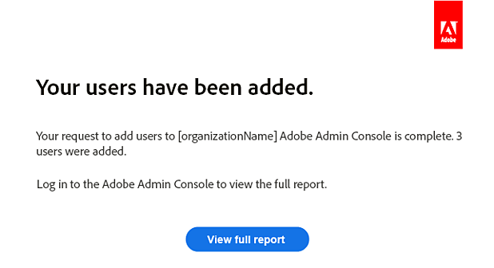

# 將現有使用者移轉至Adobe Admin Console

適用於企業和團隊。

本檔案適用於透過企業授權合約(ETLA)或Value Incentive Plan (VIP)訂閱擁有現有Creative Cloud、Document Cloud和Acrobat授權，且正移轉至其他購買方案或授權型別的組織。

>[!NOTE]
>
>如果您在北美洲，並且需要客戶經理協助您進行年度Adobe VIP合約續約，請傳送電子郵件至&#x200B;**renewalhelp@adobe.com**，我們將會儘快與您連絡。

為避免一般使用者產品存取權遺失，在現有Adobe Admin Console訂閱期限結束前，請在VIP中指派授權。

* 若為ETLA客戶，允許至少30天的產品重疊。 在週年紀念日之前完成移轉，讓使用者能持續存取Adobe應用程式和服務。 如需ETLA合約到期詳細資料，請參閱[ETLA合約的自動到期階段](https://helpx.adobe.com/enterprise/using/contract-expiry.html)。
* 若為VIP客戶，請在您目前的週年紀念日前購買授權，並在續約期限截止前指派授權VIP條款。
* CLP或TLP客戶可使用[授權](https://helpx.adobe.com/enterprise/using/licensing.html)中的移轉指示，從序列化Acrobat或Creative Suite移轉至具名使用者授權。

>[!NOTE]
>
>如果您組織的授權型別變更，一般使用者必須登出任何Adobe產品或服務，並使用相同的認證重新登入。
>
>若是桌上型電腦產品，例如Photoshop、Acrobat和Illustrator，請使用「說明」功能表中的「登出」和「登入」選項。 在Adobe.com上，使用右上角的圖示登出，然後重新登入。

## 快速授權指派（VIP到VIP）

透過VIP為企業或Acrobat （適用於企業）購買Creative Cloud的目前VIP成員，可在續約期間使用「快速授權指派」快速指派授權。 符合資格的客戶符合以下條件。

* 產品相同

   1. 續約視窗會開啟（VIP協定週年日期之前或之後30天）。
   2. 訂單上的企業產品是相當於目前條款中團隊版本的新SKU。
   3. 企業授權訂購數量大於或等於現有的團隊授權數量。

* 產品價值較高

   1. 更新視窗已開啟。
   2. 訂單上的企業產品是新的SKU，其價值高於目前期限中的團隊產品。
   3. 企業授權訂購數量大於或等於現有的團隊授權數量。

* 快速授權指派在以下情況下無法使用：

   * 訂單上的企業授權數量少於現有的團隊授權數量。
   * 訂單適用於較高價值的企業產品，但訂購的企業授權數量少於現有的團隊授權數量。
   * 無論數量為何，訂單都會混合團隊與企業產品。
   * 客戶已在續約期間之前購買團隊和企業產品。
   * 企業續約SKU用於新的企業訂單。
   * 企業產品訂單適用於不同的VIP合約編號。
   * 目前的團隊產品包含沒有企業版本的專案。

Adobe處理您的企業採購單後，您會收到一封包含指示的確認電子郵件，包括您必須將使用者從團隊授權轉移到Admin Console中的企業授權的那一天，他們才會失去存取權。

在Admin Console中，系統會提示您使用「快速授權指派」來指派授權：

1. 確認指派的授權數目。

   

2. 確認正在取消指派的團隊產品授權符合正在指派的企業授權。

3. 程式完成時，您會收到電子郵件。

   

在Admin Console中下載[結果報告](https://helpx.adobe.com/enterprise/using/users.html#main-pars_header_1346350355)以確認已指派所有授權。 如果您在確認電子郵件中的日期之前完成，一般使用者應該不會遇到服務中斷的情況。

安排Adobe入門專員（如果尚未安排）的1:1入門諮詢電話以進一步瞭解Admin Console，包括[管理員角色](https://helpx.adobe.com/enterprise/using/admin-roles.html)和[身分](https://helpx.adobe.com/tw/enterprise/using/identity.html)。

>[!NOTE]
>
>快速授權指派不會移轉在Team Admin Console中具有待定邀請的使用者。

## 大量授權指派（VIP到VIP）

使用來自[!DNL Admin Console]的CSV範本以大量作業指派授權。 在下列情況下使用此方法：

* 您是不符合快速授權指派需求的VIP客戶，或
* 您必須在續約期間之外指派授權。

1. 在您存取[Adobe Admin Console](https://adminconsole.adobe.com/enterprise)並新增授權後，請移至&#x200B;**[!UICONTROL 使用者]** > **[!UICONTROL 使用者]**。
2. 按一下頁面右上角的&#x200B;**[!UICONTROL 更多選項功能表]**，然後選擇&#x200B;**[!UICONTROL 以CSV編輯使用者詳細資訊]**。
3. 在&#x200B;**[!UICONTROL 以CSV編輯使用者]**&#x200B;對話方塊中，按一下&#x200B;**[!UICONTROL 下載CSV範本]**&#x200B;並選擇&#x200B;**[!UICONTROL 目前的使用者清單]**。

   

   如需下載檔案中的欄位說明，請參閱[CSV檔案格式](https://helpx.adobe.com/enterprise/using/users.html#main-pars_header)。
4. 將授權指派新增至CSV，然後將更新的檔案拖曳至&#x200B;**[!UICONTROL 透過CSV編輯使用者]**&#x200B;對話方塊中，並按一下&#x200B;**[!UICONTROL 上傳]**。 作業完成時，您會收到電子郵件。

   

下載[結果報表](https://helpx.adobe.com/enterprise/using/users.html#main-pars_header_1346350355)以驗證指派。 接著，安排與Adobe入門專員上線，以瞭解[管理角色](https://helpx.adobe.com/enterprise/using/admin-roles.html)和[身分](https://helpx.adobe.com/tw/enterprise/using/identity.html)。

## 大量授權指派（VIP到ETLA）

如果您有VIP訂閱且要將使用者移至ETLA，請使用此大量流程：

1. 登入[Adobe Admin Console](https://adminconsole.adobe.com/enterprise)並開啟包含您VIP使用者的組織。
2. 移至&#x200B;**[!UICONTROL 使用者]** > **[!UICONTROL 使用者]**。
3. 按一下右上角的，然後選擇&#x200B;**[!UICONTROL 將使用者清單匯出為CSV]**。
4. 開啟您想要這些使用者的ETLA組織。
5. 移至&#x200B;**[!UICONTROL 使用者]** > **[!UICONTROL 使用者]**。
6. 按一下&#x200B;**[!UICONTROL [透過CSV新增使用者]]**。
7. 按一下&#x200B;**[!UICONTROL 下載CSV範本]**，然後從您在步驟3中匯出的CSV新增VIP使用者。
8. 上傳更新的CSV。

當使用者新增至ETLA組織時，您會收到電子郵件。

下載[結果報表](https://helpx.adobe.com/enterprise/using/users.html#main-pars_header_1346350355)以驗證指派。 安排[管理員角色](https://helpx.adobe.com/enterprise/using/admin-roles.html)和[身分識別](https://helpx.adobe.com/tw/enterprise/using/identity.html)的Adobe入門專員入門。

如需大量上傳問題，請參閱[疑難排解大量使用者上傳](https://helpx.adobe.com/enterprise/kb/troubleshoot-bulk-user-csv-upload.html)。

## 大量授權指派（ETLA到VIP）

如果您有ETLA訂閱且要將使用者移至VIP：

1. 登入[Adobe Admin Console](https://adminconsole.adobe.com/enterprise)並開啟包含您ETLA使用者的組織。
2. 移至&#x200B;**[!UICONTROL 使用者]** > **[!UICONTROL 使用者]**。
3. 按一下右上角的，然後選擇&#x200B;**[!UICONTROL 將使用者清單匯出為CSV]**。

   

4. 開啟您想要這些使用者的VIP組織。
5. 移至&#x200B;**[!UICONTROL 使用者]** > **[!UICONTROL 使用者]**。
6. 按一下&#x200B;**[!UICONTROL [透過CSV新增使用者]]**。
7. 按一下&#x200B;**[!UICONTROL 下載CSV範本]**，然後從您在步驟3中匯出的CSV新增ETLA使用者。
8. 上傳更新的CSV。

當使用者新增至VIP組織時，您會收到電子郵件。

下載[結果報表](https://helpx.adobe.com/enterprise/using/users.html#main-pars_header_1346350355)以驗證指派。 安排[管理員角色](https://helpx.adobe.com/enterprise/using/admin-roles.html)和[身分識別](https://helpx.adobe.com/tw/enterprise/using/identity.html)的Adobe入門專員入門。

如需大量上傳問題，請參閱[疑難排解大量使用者上傳](https://helpx.adobe.com/enterprise/kb/troubleshoot-bulk-user-csv-upload.html)。

