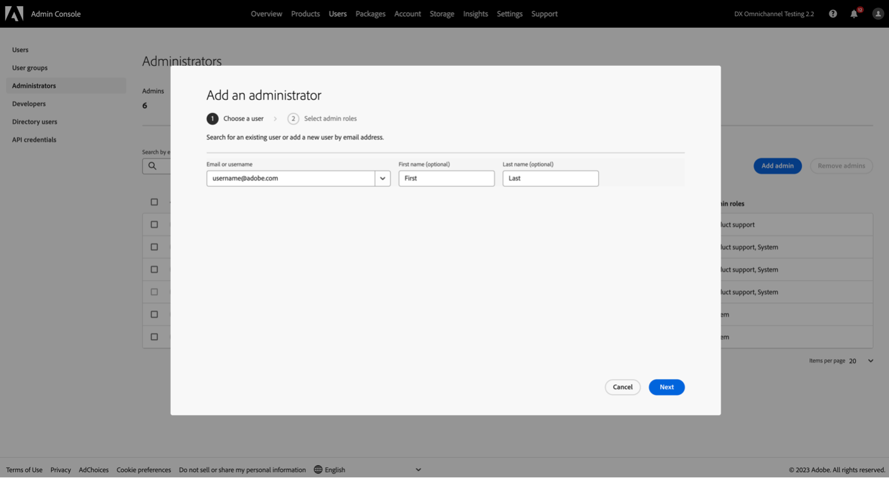
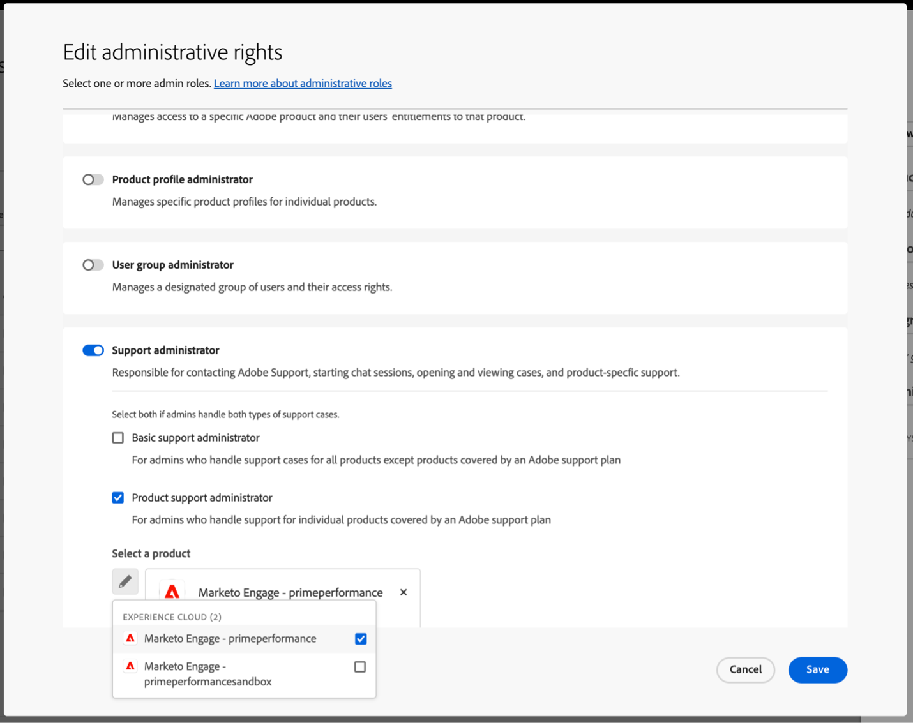

# Adobe客戶支援權益

若要設定組織的支援權益，請先透過Admin Console新增或邀請使用者。

## 將支援權利角色新增至組織

支援管理員角色是非管理角色，可存取支援相關資訊。 支援管理員可以檢視、建立和管理問題報告。

若要新增或邀請管理員：

1. 在Admin Console中，選擇&#x200B;**[!UICONTROL 使用者]** > **[!UICONTROL 管理員]**。
1. 按一下&#x200B;**[!UICONTROL 新增管理員]**。
1. 輸入名稱或電子郵件地址。

   您可以搜尋現有使用者，或透過指定有效的電子郵件地址並在畫面上填寫資訊來新增使用者。

   

1. 按一下&#x200B;**[!UICONTROL 下一步]**。 管理員角色清單隨即顯示。

若要將支援管理員角色指派給使用者（讓使用者能夠聯絡支援人員）：

1. 選取&#x200B;**[!UICONTROL 支援管理員]**&#x200B;選項。

   

1. 選擇下列兩個選項之一：

   * 選項1： **[!UICONTROL 基本支援管理員]**。 如果您要為使用者提供所有解決方案(Marketo Engage除外)的支援存取權，請選取此選項。
   * 選項2： **[!UICONTROL 產品支援管理員]**：選取此選項以支援Marketo Engage。 選取要授與使用者支援存取權的Marketo Engage執行個體。

   

1. 選取之後，按一下[儲存]。**&#x200B;**

使用者會收到來自`message@adobe.com`有關新系統管理許可權的電子郵件邀請。

使用者必須按一下電子郵件中的&#x200B;**[!UICONTROL 開始使用]**&#x200B;才能加入組織。 如果新的管理員未使用電子郵件邀請中的&#x200B;**[!UICONTROL 開始使用]**&#x200B;連結，他們將無法登入Admin Console。

在登入過程中，如果使用者尚未設定Adobe設定檔，他們可能會被要求設定。 如果使用者有多個與其電子郵件地址相關聯的設定檔，使用者必須選擇&#x200B;**[!UICONTROL 加入團隊]** （如果提示），然後選取與新組織相關聯的設定檔。

如需詳細資訊，請參閱管理角色檔案中的[編輯企業管理員角色](admin-roles.md#add-enterprise-role)指示。 請注意，只有您組織的系統管理員可以指派此角色。 如需管理階層的詳細資訊，請瀏覽[管理角色](admin-roles.md)檔案。
