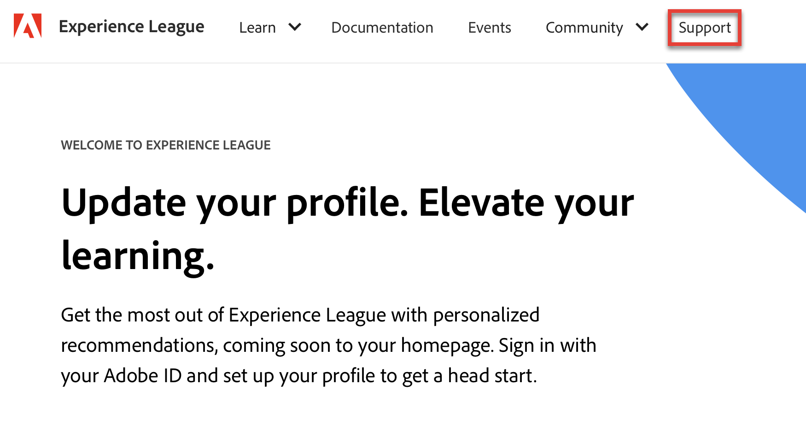
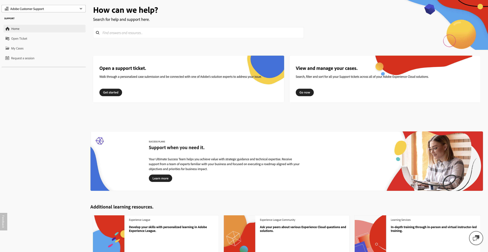
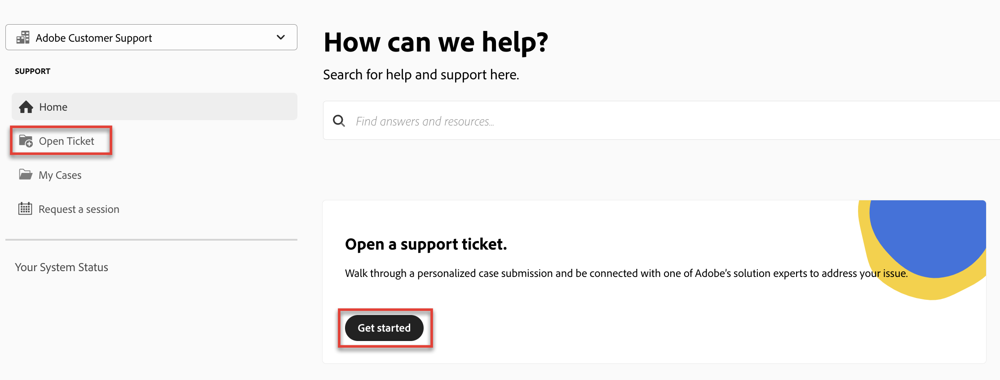
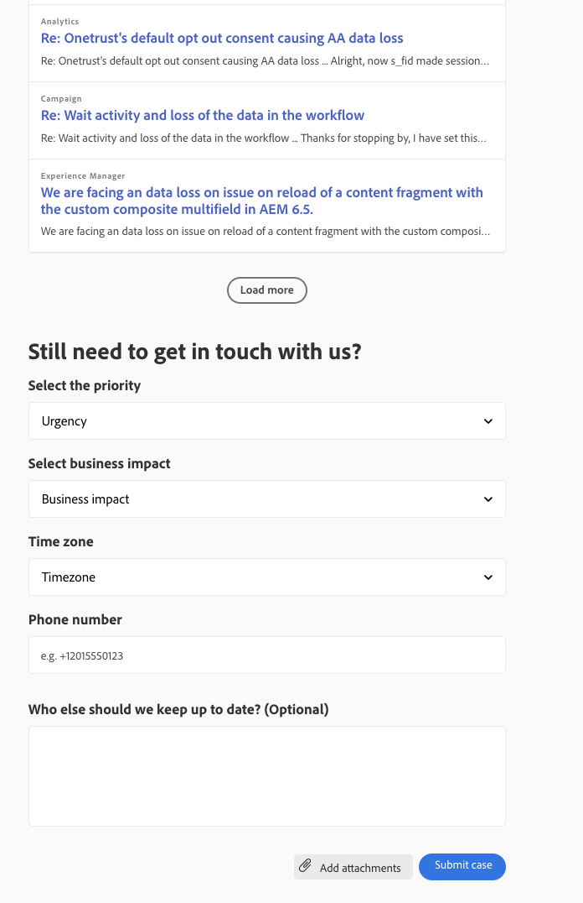

# Adobe客戶支援體驗

本文說明如何使用Experience League提交支援票證及管理案例相關的存取。

## Experience League支援票證

現已透過[Experience League](https://experienceleague.adobe.com/home#support)提交支援票證。 如需如何提交支援票證的說明，請參閱[提交支援票證](#create-a-support-ticket-with-experience-league)的區段。

我們正致力改善您與Adobe客戶支援的互動方式。 我們的願景是使用Experience League移至單一入口點，以簡化支援體驗。 上線後，您的組織將能夠輕鬆存取Adobe客戶支援；透過跨產品的通用系統更清楚地瞭解您的服務記錄；透過電話、網路和透過單一入口網站聊天請求協助。

如果您是Adobe Commerce使用者，請參閱Adobe Commerce的Experience League支援使用指南中的[提交支援案例](https://experienceleague.adobe.com/en/docs/commerce-knowledge-base/kb/help-center-guide/magento-help-center-user-guide#support-case)。

## 案例提交所需的支援授權角色 {#submit-ticket}

若要在[Experience League](https://experienceleague.adobe.com/home#support)中提交支援票證，您需要系統管理員指派支援管理員角色。 只有您組織中的系統管理員可以指派此角色。 產品、產品設定檔及其他管理角色無法指派支援管理員角色，也無法檢視用於提交支援票證的&#x200B;**[!UICONTROL 建立案例]**&#x200B;選項。 若要深入瞭解不同型別的管理員角色及其權益，請參閱[管理員角色](admin-roles.md)。 如果您在提交案例之前需要設定這些支援權利，請參閱[Adobe客戶支援權利設定](adobe-customer-support-entitlement-configuration.md)。

如果您使用Commerce，共用存取許可權以處理支援案例的流程會不同。 若要瞭解更多資訊，請參閱Adobe Commerce的Experience League支援使用指南中的[共用存取權：授予其他使用者存取您帳戶的許可權](https://experienceleague.adobe.com/en/docs/commerce-knowledge-base/kb/help-center-guide/magento-help-center-user-guide#shared-access)。

### 使用Experience League建立支援票證

>[!NOTE]
>
> 在提交支援票證之前，請考慮檢查[Adobe狀態](https://status.adobe.com)網站上的Adobe系統效能、使用狀態和解決方案問題。

提交支援案例的程式現在直接與Experience League支援平台整合。 這是自助式入口網站，最近經過重新設計，提供更個人化且易於使用的權利客戶。

1. 若要使用[Experience League](https://experienceleague.adobe.com/home#support)建立票證，請選取頂端導覽列中的&#x200B;**[!UICONTROL 支援]**索引標籤。
   
1. 從支援首頁，您可以輕鬆導覽至未解決的支援案例、記錄新案例、檢視熱門支援文章或存取其他學習來源。
   
1. 若要提交案例，請選取&#x200B;**[!UICONTROL 開啟支援票證]**。 同時選取側邊欄功能表上的&#x200B;**[!UICONTROL 開啟票證]**&#x200B;選項。

### 填寫支援票證

1. 選取&#x200B;**[!UICONTROL 開啟支援票證]**&#x200B;後，您將會導向至案例建立頁面，您可在此輸入產品名稱(Audience Manager、Campaign、Target等)、**[!UICONTROL 案例標題]**&#x200B;和&#x200B;**[!UICONTROL 案例說明]**。

   

   若要加快疑難排解程式，請在&#x200B;**[!UICONTROL 案例描述]**&#x200B;欄位中新增下列資訊：

   * 清除問題陳述
   * 重現問題的步驟
   * 業務影響宣告
   * 這是新的實施/功能/開發嗎？
   * 程式何時運作？
   * 疑難排解步驟
   * 相關記錄檔資料
   * 版本號碼
   * 建置資訊（如果相關）
   * 關鍵識別碼

1. 選取任何解決方案時，系統會詢問您下列內容，有些解決方案會有其他欄位：

   * 案例優先順序(低、Medium、高、嚴重)
   * 業務影響
   * 客戶時區（美洲、EMEA、APAC）

   如需案例優先順序與業務影響如何影響支援回應時間的詳細資訊，請參閱成功計畫資原始檔中的[支援的目標初始回應時間](https://experienceleague.adobe.com/en/docs/support-resources/data-sheets/overview#targeted-initial-response-times-for-support)。

>[!TIP]
>
> 如果您看不到&#x200B;**[!UICONTROL 建立案例]**&#x200B;選項或&#x200B;**[!UICONTROL 支援]**&#x200B;標籤，您必須連絡系統管理員以指派支援管理員角色。

>[!NOTE]
>
> 如果問題導致生產系統中斷或嚴重中斷，則會提供電話號碼以立即獲得協助。

