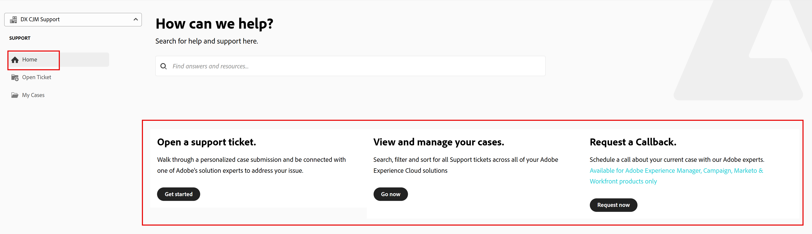
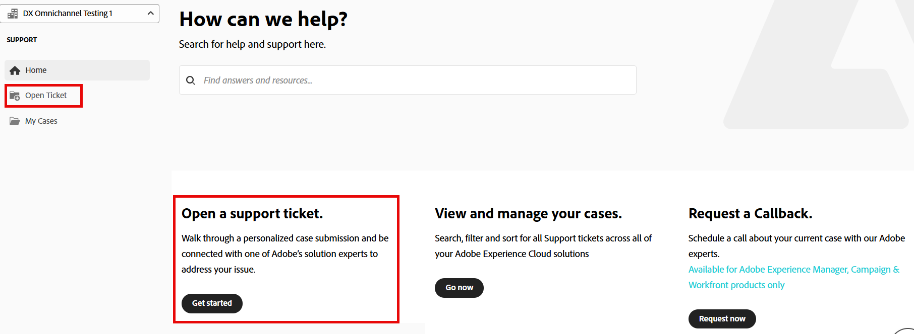
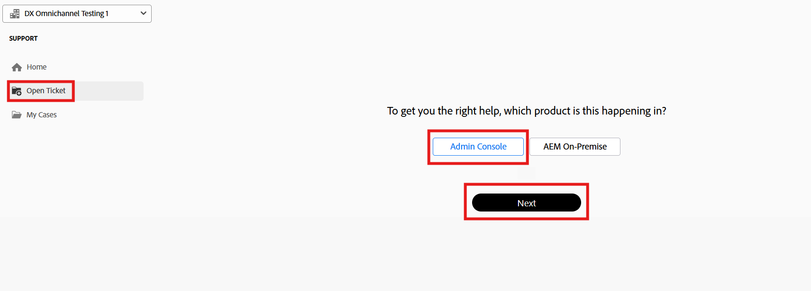
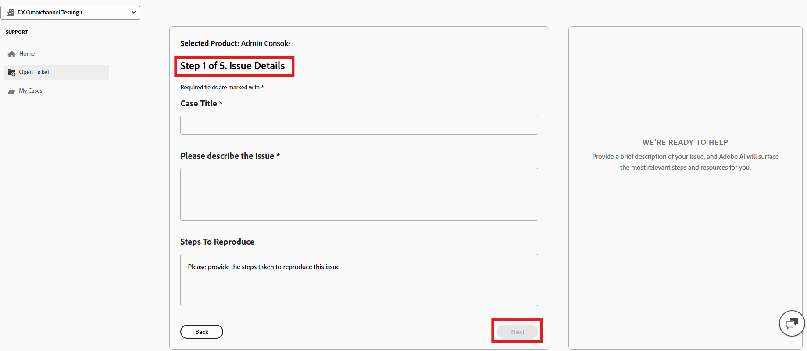
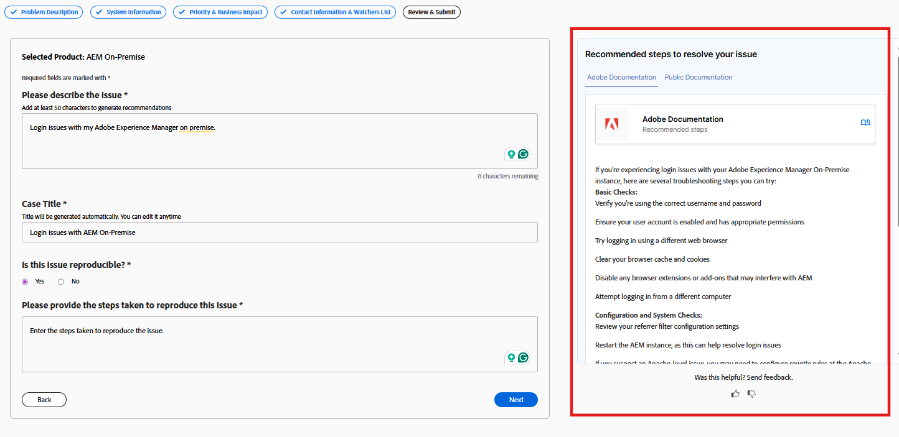
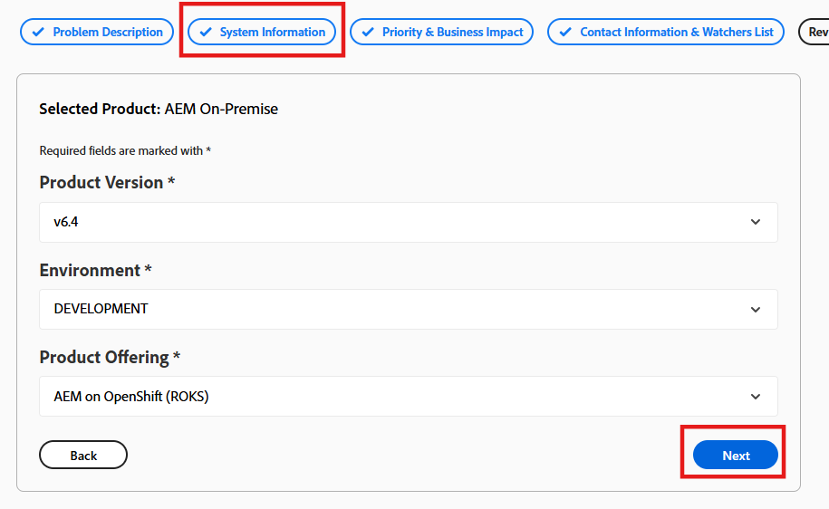
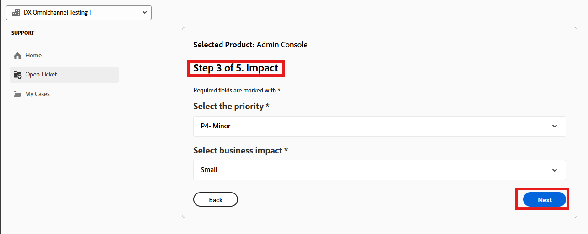
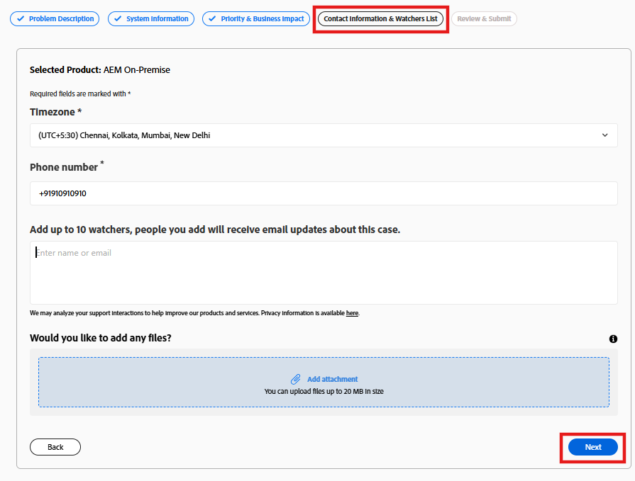
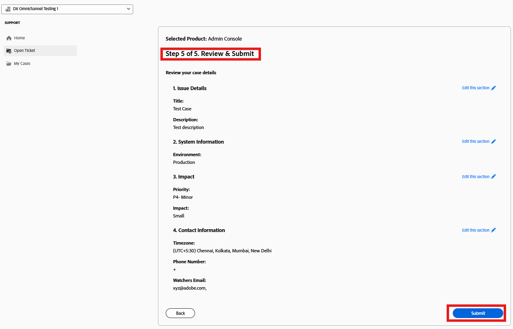

# Adobe客戶支援體驗

## Experience League支援票證

現已透過[Experience League](https://experienceleague.adobe.com/home#support)提交支援票證。 如需如何提交支援票證的說明，請參閱[提交支援票證](#create-a-support-ticket-with-experience-league)的區段。

我們正致力改善您與Adobe客戶支援的互動方式。 我們的願景是使用Experience League移至單一入口點，以簡化支援體驗。 上線後，您的組織將能夠輕鬆存取Adobe客戶支援；透過跨產品的通用系統更清楚地瞭解您的服務記錄；透過電話、網路和透過單一入口網站聊天請求協助。

如果您是Adobe Commerce使用者，請參閱Adobe Commerce的Experience League支援使用指南中的[提交支援案例](https://experienceleague.adobe.com/en/docs/commerce-knowledge-base/kb/help-center-guide/magento-help-center-user-guide#support-case)。

## 案例提交所需的支援授權角色 {#submit-ticket}

若要在[Experience League](https://experienceleague.adobe.com/home#support)中提交支援票證，您需要系統管理員指派支援管理員角色。 只有您組織中的系統管理員可以指派此角色。 產品、產品設定檔及其他管理角色無法指派支援管理員角色，也無法檢視用於提交支援票證的&#x200B;**[!UICONTROL 建立案例]**&#x200B;選項。 若要深入瞭解不同型別的管理員角色及其權益，請參閱[管理員角色](admin-roles.md)。

如果您使用Commerce，共用存取許可權以處理支援案例的流程會不同。 若要瞭解更多資訊，請參閱Adobe Commerce的Experience League支援使用指南中的[共用存取權：授予其他使用者存取您帳戶的許可權](https://experienceleague.adobe.com/en/docs/commerce-knowledge-base/kb/help-center-guide/magento-help-center-user-guide#shared-access)。

### 新增支援可讓角色擁有組織許可權

支援管理員角色是非管理角色，可存取支援相關資訊。 支援管理員可以檢視、建立和管理問題報告。

若要新增或邀請管理員：

1. 在Admin Console中，選擇&#x200B;**[!UICONTROL 使用者]** > **[!UICONTROL 管理員]**。
1. 按一下&#x200B;**[!UICONTROL 新增管理員]**。
1. 輸入名稱或電子郵件地址。

   您可以搜尋現有使用者，或透過指定有效的電子郵件地址並在畫面上填寫資訊來新增使用者。

   

1. 按一下&#x200B;**[!UICONTROL 下一步]**。 管理員角色清單隨即顯示。

若要將支援管理員角色指派給使用者（讓使用者能夠聯絡支援人員）：

1. 選取&#x200B;**[!UICONTROL 支援管理員]**&#x200B;選項。

   

1. 選擇下列兩個選項之一：

   * 選項1： **[!UICONTROL 基本支援管理員]**。 如果您要為使用者提供所有解決方案(Marketo Engage除外)的支援存取權，請選取此選項。
   * 選項2： **[!UICONTROL 產品支援管理員]**：選取此選項以支援Marketo Engage。 選取要授與使用者支援存取權的Marketo Engage執行個體。

   

1. 選取之後，按一下[儲存]。****

使用者會收到來自`message@adobe.com`有關新系統管理許可權的電子郵件邀請。

使用者必須按一下電子郵件中的&#x200B;**開始使用**&#x200B;才能加入組織。 如果新的管理員未使用電子郵件邀請中的&#x200B;**開始使用**&#x200B;連結，他們將無法登入Admin Console。

在登入過程中，如果使用者尚未設定Adobe設定檔，他們可能會被要求設定。 如果使用者有多個與其電子郵件地址相關聯的設定檔，使用者必須選擇&#x200B;**加入團隊** （如果提示），然後選取與新組織相關聯的設定檔。

如需詳細資訊，請依照管理角色檔案中的[編輯企業管理員角色](admin-roles.md#add-enterprise-role)指示操作。 請注意，只有您組織的系統管理員可以指派此角色。 如需管理階層的詳細資訊，請瀏覽[管理角色](admin-roles.md)檔案。

### 使用Experience League建立支援票證

>[!NOTE]
>
> 在提交支援票證之前，請檢查[Adobe狀態](https://status.adobe.com)網站上的Adobe系統效能、使用狀態和已知問題。

Experience League是自助服務支援入口網站，專為提供個人化協助以及授權客戶易用的體驗而設計。

1. 若要在[Experience League](https://experienceleague.adobe.com/home#support)中建立票證，請選取頂端導覽列中的&#x200B;**[!UICONTROL 支援]**&#x200B;索引標籤。

   

1. 從&#x200B;**[!UICONTROL 首頁]**&#x200B;功能表，您可以&#x200B;**[!UICONTROL 開啟支援票證]**、**[!UICONTROL 檢視及管理您的案例]**、**[!UICONTROL 要求回撥]**&#x200B;或存取其他學習資源。

   

1. 若要提交案例，請選取&#x200B;**[!UICONTROL 開啟支援票證]**。 您也可以在側邊欄功能表中選取&#x200B;**[!UICONTROL 開啟票證]**。

   

### 填寫支援票證

選取&#x200B;**[!UICONTROL 開啟支援票證]**&#x200B;或&#x200B;**[!UICONTROL 開啟票證]**&#x200B;後，案例建立頁面就會顯示。

表單使用引導式多步驟工作流程：

* 選取受影響的Adobe產品
* 說明問題
* 提供系統和環境詳細資訊
* 表示影響和急迫性
* 確認聯絡資訊
* 檢閱並提交詳細資訊

請依照下列步驟建立支援票證：

1. 按一下產品名稱以選取受影響的產品，然後按一下[下一步]****。

   

1. 在&#x200B;**[!UICONTROL 問題詳細資訊]**&#x200B;區段中，輸入案例標題、說明問題，並提供要再現的步驟。

   

   包含下列詳細資訊：

   * 您正在嘗試執行的動作
   * 未如預期運作
   * 任何最近的環境變更
   * 您已採取的步驟

   當您輸入問題詳細資訊時，Experience League會在表單旁的面板中顯示AI支援的建議。 這些建議：

   * 提供相關檔案或已知解決方案的建議
   * 協助您確認問題是否已解決
   * 減少提交常見問題案例的需求

   此時會顯示面板，而不會中斷案例建立程式。 您可以隨時檢閱建議，並視需要繼續提交案例。

   

1. 按一下&#x200B;**[!UICONTROL 下一步]**。

1. 在&#x200B;**[!UICONTROL 系統資訊]**&#x200B;區段中，選取環境，然後按一下&#x200B;**[!UICONTROL 下一步]**。

   >[!NOTE]
   >
   > 根據所選產品，可能會顯示其他欄位。 這些欄位包含問題發生環境的相關詳細資訊。

   

1. 在&#x200B;**[!UICONTROL Impact]**&#x200B;區段中，選取下列專案：
   * 案例優先順序（P4 — 次要、P3 — 重要、P2 — 緊急、P1 — 嚴重）
   * 業務影響(小、Medium、大)

   

   如需案例優先順序與業務影響如何影響支援回應時間的詳細資訊，請參閱成功計畫資原始檔中的[支援的目標初始回應時間](https://experienceleague.adobe.com/en/docs/support-resources/data-sheets/overview#targeted-initial-response-times-for-support)。

1. 按一下&#x200B;**[!UICONTROL 下一步]**。

1. 在&#x200B;**[!UICONTROL 連絡資訊]**&#x200B;區段中，選取時區、輸入您的電話號碼、新增觀察者、視需要附加任何檔案，然後按一下&#x200B;**[!UICONTROL 下一步]**。

   

1. 在&#x200B;**[!UICONTROL 檢閱和提交]**&#x200B;區段中，檢閱您的案例詳細資料，然後按一下&#x200B;**[!UICONTROL 提交]**。

   

   **[!UICONTROL 檢閱和提交]**&#x200B;步驟會摘要所有輸入的資訊，並可讓您：

   * 在一個位置檢閱所有案例詳細資訊
   * 導覽回任何先前的步驟以進行編輯
   * 回到稽核摘要而不會失去進度

提交後：

* 此案例已登入Experience League
* 您可以追蹤更新，並透過入口網站與支援人員通訊
* Adobe支援會根據您提供的優先順序和影響做出回應

>[!TIP]
>
> 如果您看不到&#x200B;**[!UICONTROL 開啟票證]**&#x200B;選項或&#x200B;**[!UICONTROL 支援]**&#x200B;標籤，請連絡您的系統管理員以指派支援管理員角色。

>[!NOTE]
>
> 如果問題造成生產系統中斷或嚴重中斷，則會提供電話號碼以取得即時協助。
