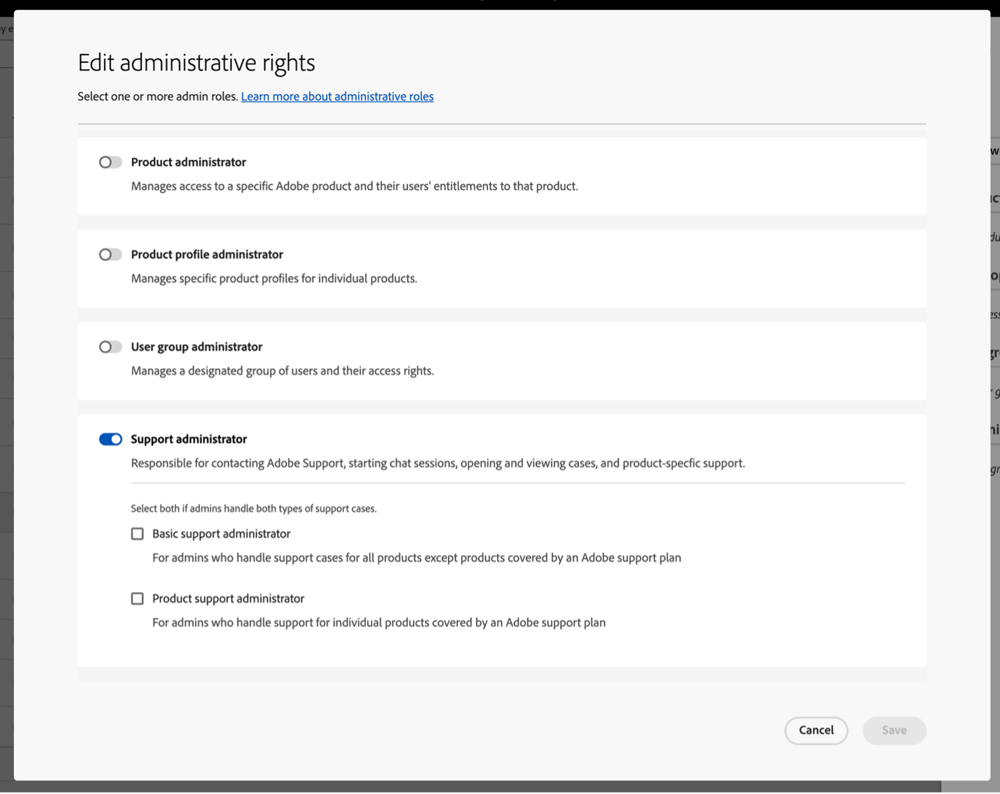
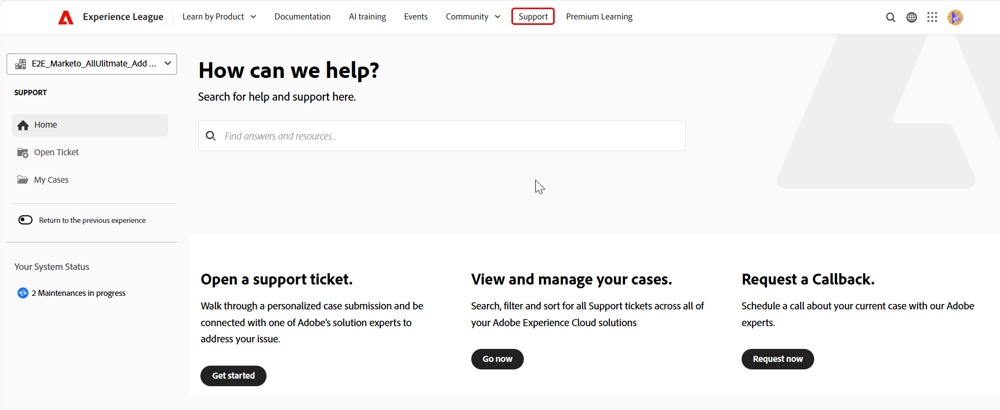
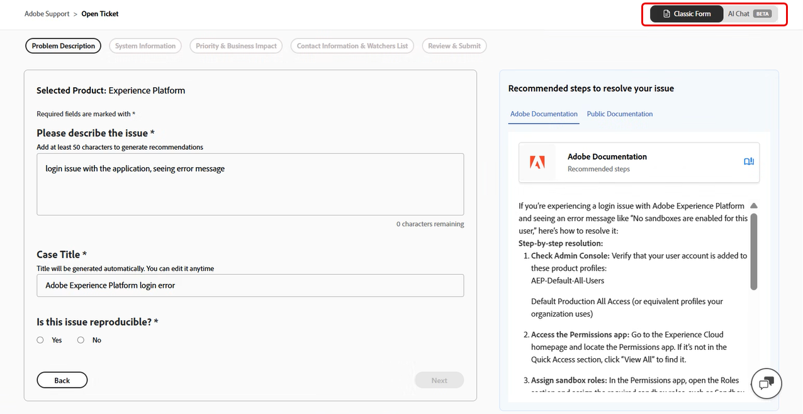
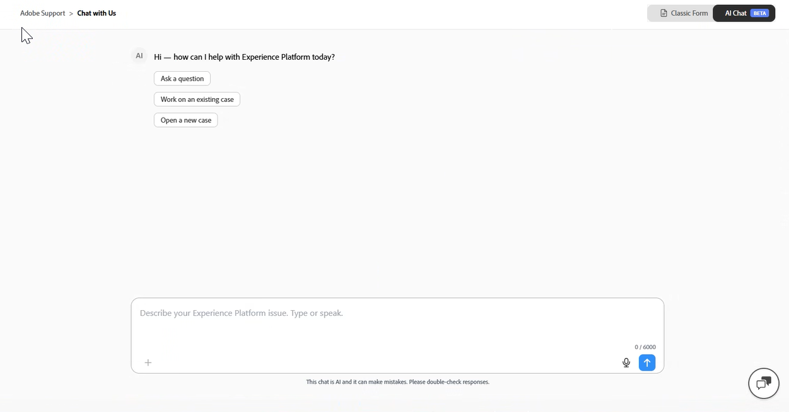

# Adobe客戶支援體驗

## Experience League支援票證

現已透過[Experience League](https://experienceleague.adobe.com/home#support)提交支援票證。 如需如何提交支援票證的說明，請參閱[提交支援票證](#create-a-support-ticket-with-experience-league)的區段。

我們正致力改善您與Adobe客戶支援的互動方式。 我們的願景是使用Experience League移至單一入口點，以簡化支援體驗。 上線後，您的組織將能夠輕鬆存取Adobe客戶支援；透過跨產品的通用系統更清楚地瞭解您的服務歷史記錄；透過電話、網路和透過單一入口網站聊天請求協助。

如果您是Adobe Commerce使用者，請參閱Adobe Commerce的Experience League支援使用指南中的[提交支援案例](https://experienceleague.adobe.com/en/docs/commerce-knowledge-base/kb/help-center-guide/magento-help-center-user-guide#support-case)。

## 案例提交所需的支援授權角色 {#submit-ticket}

若要在[Experience League](https://experienceleague.adobe.com/home#support)中提交支援票證，您需要系統管理員指派支援管理員角色。 只有您組織中的系統管理員可以指派此角色。 產品、產品設定檔及其他管理角色無法指派支援管理員角色，也無法檢視用於提交支援票證的&#x200B;**[!UICONTROL 建立案例]**&#x200B;選項。 若要深入瞭解不同型別的管理員角色及其權益，請參閱[管理員角色](adobe-admin-console/admin-roles.md)。

如果您使用Commerce，共用存取許可權以處理支援案例的流程會不同。 若要瞭解更多資訊，請參閱Adobe Commerce的Experience League支援使用指南中的[共用存取權：授予其他使用者存取您帳戶的許可權](https://experienceleague.adobe.com/en/docs/commerce-knowledge-base/kb/help-center-guide/magento-help-center-user-guide#shared-access)。

### 新增支援可讓角色擁有組織許可權

支援管理員角色是非管理角色，可存取支援相關資訊。 支援管理員可以檢視、建立和管理問題報告。

若要新增或邀請管理員：

1. 在Admin Console中，選擇&#x200B;**[!UICONTROL 使用者]** > **[!UICONTROL 管理員]**。
1. 按一下&#x200B;**[!UICONTROL 新增管理員]**。
1. 輸入名稱或電子郵件地址。

   您可以搜尋現有使用者，或透過指定有效的電子郵件地址並在畫面上填寫資訊來新增使用者。

   

1. 按一下&#x200B;**[!UICONTROL 下一步]**。 管理員角色清單隨即顯示。

若要將支援管理員角色指派給使用者（讓使用者能夠聯絡支援人員）：

1. 選取&#x200B;**[!UICONTROL 支援管理員]**&#x200B;選項。

   

1. 選擇下列兩個選項之一：

   * 選項1： **[!UICONTROL 基本支援管理員]**。 如果您要為使用者提供所有解決方案（Marketo Engage除外）的支援存取權，請選取此選項。
   * 選項2： **[!UICONTROL 產品支援管理員]**：選取此選項以支援Marketo Engage。 選取要授與使用者支援存取權的Marketo Engage執行個體。

   

1. 選取之後，按一下[儲存]。****

使用者會收到來自`message@adobe.com`有關新系統管理許可權的電子郵件邀請。

使用者必須按一下電子郵件中的&#x200B;**開始使用**&#x200B;才能加入組織。 如果新的管理員未使用電子郵件邀請中的&#x200B;**開始使用**&#x200B;連結，他們將無法登入Admin Console。

在登入過程中，如果使用者尚未設定Adobe設定檔，他們可能會被要求設定。 如果使用者有多個與其電子郵件地址相關聯的設定檔，使用者必須選擇&#x200B;**加入團隊** （如果提示），然後選取與新組織相關聯的設定檔。

如需詳細資訊，請依照管理角色檔案中的[編輯企業管理員角色](adobe-admin-console/admin-roles.md#add-enterprise-role)指示操作。 請注意，只有您組織的系統管理員可以指派此角色。 如需管理階層的詳細資訊，請瀏覽[管理角色](adobe-admin-console/admin-roles.md)檔案。

### 使用Experience League建立支援票證

>[!NOTE]
>
> 在提交支援票證之前，請檢查[Adobe狀態](https://status.adobe.com)網站上的Adobe系統效能、使用狀態和已知問題。

Experience League是自助服務支援入口網站，專為提供個人化協助以及授權客戶易用的體驗而設計。

1. 若要在[Experience League](https://experienceleague.adobe.com/home#support)中建立票證，請選取頂端導覽列中的&#x200B;**[!UICONTROL 支援]**&#x200B;索引標籤。

   

1. 從&#x200B;**[!UICONTROL 首頁]**&#x200B;功能表，您可以&#x200B;**[!UICONTROL 開啟支援票證]**、**[!UICONTROL 檢視及管理您的案例]**、**[!UICONTROL 要求回撥]**&#x200B;或存取其他學習資源。

   **[!UICONTROL 要求回撥]**&#x200B;選項可讓您排程具有熒幕共用P2和P3案例的Web會議，以更快速、更有效率的方式解決問題。 它適用於Adobe Experience Manager、Admin Console、Adobe Journey Optimizer、Analytics、Audience Manager、Campaign、Commerce、Customer Journey Analytics、GenStudio、Marketo、Real-Time Customer Data Platform、Target和Workfront。 會議排程可在客戶方便時進行。 此外，對於除Adobe Commerce以外的所有上述產品，也提供P1案例的立即電話回呼。

   

1. 若要提交案例，請選取&#x200B;**[!UICONTROL 開啟支援票證]**。 您也可以在側邊欄功能表中選取&#x200B;**[!UICONTROL 開啟票證]**。

   

### 填寫支援票證

選取&#x200B;**[!UICONTROL 開啟支援票證]**&#x200B;或&#x200B;**[!UICONTROL 開啟票證]**&#x200B;後，案例建立表單就會顯示。

此表單使用引導式多步驟工作流程，可協助您提供Adobe支援所需的資訊，以便有效疑難排解您的問題。 您可以使用下列章節來瀏覽表單：

* 產品選擇
* 問題描述
* 優先順序和業務影響
* 連絡人資訊和觀察者清單
* 檢閱並提交

您也可以&#x200B;**在區段**&#x200B;之間切換，以在提交案例之前更新資訊。

請依照下列步驟建立支援票證：

1. 按一下產品名稱以選取受影響的產品，然後按一下[下一步]****。

   

1. 在&#x200B;**[!UICONTROL 問題說明]**&#x200B;區段中，輸入問題的說明。 案例標題會根據問題說明自動產生。 您可以視需要編輯標題。 確認是否可以重新產生問題。 如果問題可重現，請選取&#x200B;**是**。 此時會出現一個文字方塊，您可在其中說明重現問題所需的步驟。 如果問題無法一致地重現，請選取&#x200B;**否**。

   

   包含下列詳細資訊：

   * 您正在嘗試執行的動作
   * 未如預期運作
   * 您已採取的步驟
   * 問題是否可重現

   當您輸入問題說明時，Experience League會在表單旁的面板中顯示AI支援的建議。 這些建議：

   * 提供相關檔案或已知解決方案的建議
   * 協助您確認問題是否已解決
   * 減少提交常見問題案例的需求

   建議面板會因應問題說明的詳細程度而顯示，不會中斷案例的建立。 您可以隨時檢閱建議，並繼續提交案例。 當問題說明&#x200B;**超過50個字元**&#x200B;時，系統會產生針對此問題量身打造的AI支援建議。

   >[!NOTE]
   >
   >AI支援的建議不會針對Adobe Admin Console產品顯示。

   

   當描述包含&#x200B;**少於50個字元**&#x200B;時，系統會顯示建議的文章作為指引。 內建字元計數器會即時追蹤最低需求。

   

1. 按一下&#x200B;**[!UICONTROL 下一步]**。

   

1. 在&#x200B;**[!UICONTROL 系統資訊]**&#x200B;區段中，提供&#x200B;**[!UICONTROL 產品版本]**、**[!UICONTROL 環境]**、**[!UICONTROL 產品方案]**，並指示是否對環境或執行個體進行了任何最近的變更。 選取「**是**」以提供有關變更的其他詳細資料。 若未進行任何變更，請選取&#x200B;**否**，然後按一下[下一步]]**。**[!UICONTROL 

   >[!NOTE]
   >
   > 根據所選產品，可能會顯示其他欄位。 這些欄位包含問題發生環境的相關詳細資訊。

   

1. 在&#x200B;**[!UICONTROL 優先順序和業務影響]**&#x200B;區段中，選取下列專案：
   * 案例優先順序（P4 — 次要、P3 — 重要、P2 — 緊急、P1 — 嚴重）
   * 當選取的優先順序為P1 — 嚴重時，提供業務影響詳細資訊，然後按一下&#x200B;**[!UICONTROL 下一步]**。

   

   如需案例優先順序與業務影響如何影響支援回應時間的詳細資訊，請參閱成功計畫資原始檔中的[支援的目標初始回應時間](https://experienceleague.adobe.com/en/docs/support-resources/data-sheets/overview#targeted-initial-response-times-for-support)。

1. 在&#x200B;**[!UICONTROL 連絡人資訊與觀察者清單]**&#x200B;區段中，選取時區、輸入您的電話號碼、新增觀察者、視需要附加任何檔案，然後按一下&#x200B;**[!UICONTROL 下一步]**。

   

1. 在&#x200B;**[!UICONTROL 檢閱與提交]**&#x200B;區段中，檢閱您的案例詳細資料，然後按一下&#x200B;**[!UICONTROL 核准與提交案例]**。

   

   **[!UICONTROL 檢閱和提交]**&#x200B;步驟會摘要所有輸入的資訊，並可讓您：

   * 在一個位置檢閱所有案例詳細資訊
   * 導覽回任何先前的步驟以進行編輯
   * 回到稽核摘要而不會失去進度

提交後：

* 此案例已登入Experience League
* 您可以追蹤更新，並透過入口網站與支援人員通訊
* Adobe支援會根據您提供的優先順序和影響做出回應

>[!TIP]
>
> 如果您看不到&#x200B;**[!UICONTROL 開啟票證]**&#x200B;選項或&#x200B;**[!UICONTROL 支援]**&#x200B;標籤，請連絡您的系統管理員以指派支援管理員角色。

>[!NOTE]
>
> 如果問題造成生產系統中斷或嚴重中斷，則會提供電話號碼以取得即時協助。

### 案例建立體驗中的AI聊天

Experience League支援提供AI支援的聊天介面，作為建立和管理支援案例的替代方式。 AI聊天體驗為選擇加入，不會取代傳統的案例建立工作流程。

>[!NOTE]
>
> AI聊天目前以Beta版功能提供。 傳統案例建立表單仍可隨時完整使用及存取。

若要存取AI聊天，請遵循以下步驟：

1. 瀏覽至&#x200B;**[!UICONTROL 首頁]**&#x200B;並選取&#x200B;**[!UICONTROL 開啟支援票證]**。 您也可以在側邊欄功能表中選取&#x200B;**[!UICONTROL 開啟票證]**。

   

1. 按一下產品名稱以選取受影響的產品，然後按一下[下一步]****。
1. 在右上角，選取&#x200B;**[!UICONTROL AI聊天]**。

   

若要在&#x200B;**[!UICONTROL 傳統表單]**&#x200B;和&#x200B;**[!UICONTROL AI聊天]**&#x200B;之間切換，請使用右上角的切換按鈕。 切換時不會延續目前的進度，但已完成的案例或動作不會受到影響。

### 開始使用AI聊天

開啟AI聊天時，您會看到下列選項：

* **[!UICONTROL 提出問題]**
* **[!UICONTROL 處理現有案例]**
* **[!UICONTROL 開啟新案例]**

  

您可以在文字欄位中輸入內容或使用語音轉文字來說明問題。

#### 提出問題

選取&#x200B;**[!UICONTROL 提出問題]**，直接在聊天中取得產品、Adobe服務及支援相關問題的即時解答，而不需要開啟支援案例。

AI會利用Adobe知識庫，根據您的查詢提供相關答案、檔案連結和已知解決方案。

如果AI無法直接在聊天中解決您的查詢，它將引導您開啟新的支援案例，以與Adobe支援團隊聯絡。

#### 處理現有案例

選取&#x200B;**[!UICONTROL 處理現有案例]**，直接在聊天室中管理並取得現有支援案例的更新。

AI會顯示您未解決的案例清單。 您可以根據案例在清單中的位置或其案例編號來參考案例，以選取您要處理的案例。

選取案例後，您可以：

* 要求摘要
* 檢查更新
* 採取跟進動作，例如上呈案件或在相同聊天體驗中要求回撥。

#### 開啟新案例

選取&#x200B;**[!UICONTROL 開啟新案例]**&#x200B;以您自己的文字描述您的問題，而非填寫結構化表單欄位。

AI會提出目標性的後續問題，以收集所需的詳細資訊，並依據您的回應動態調整流程，藉此引導您完成案例建立程式。

AI會收集必要的資訊，例如：

* 產品詳細資料
* 問題型別
* 重製步驟

如果在提交時無法取得資訊，則可略過選用欄位。

收集到足夠的資訊後，AI就會根據您的交談自動產生結構化的案例摘要，包括：

* 案例標題
* 說明
* 重製步驟

您可以在提交之前檢閱草稿，以確保所有詳細資料都正確無誤，而且您可以在案例建立對話期間或之後隨時新增附件、記錄、熒幕擷取畫面及其他補充詳細資訊，以向支援團隊提供其所需的完整內容。
