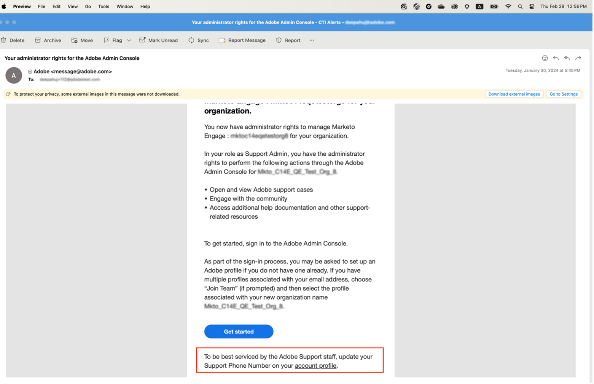
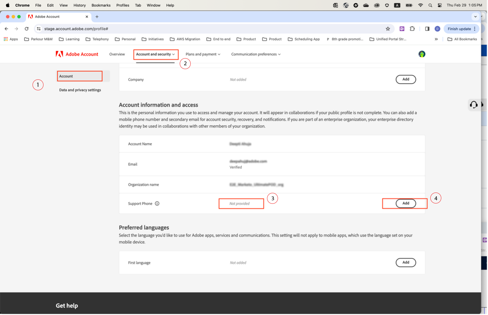
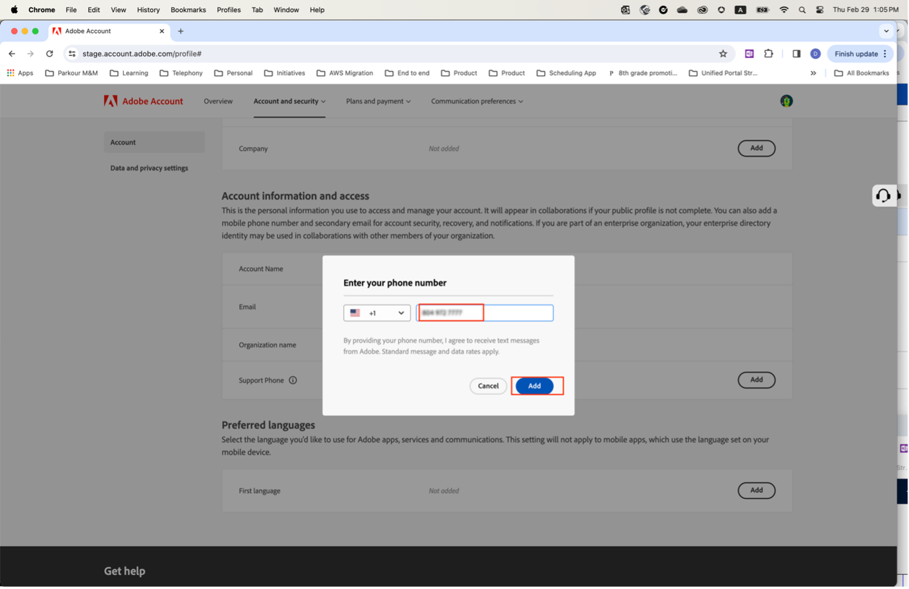
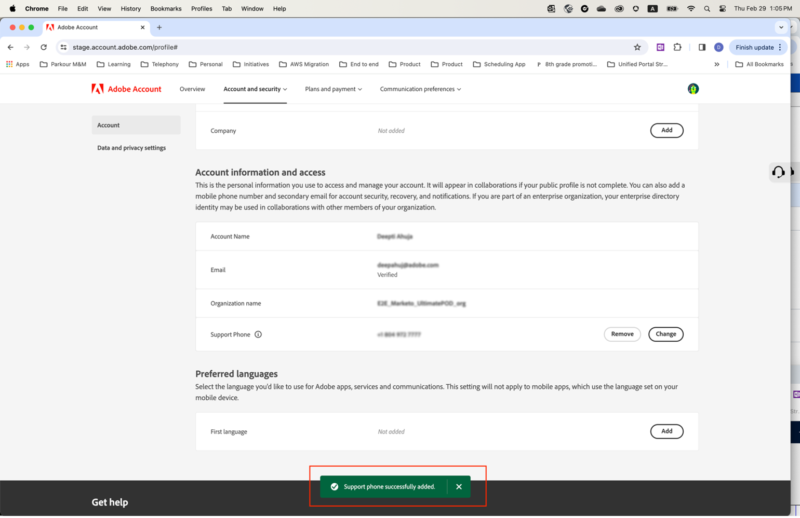

# 指定偏好的支援電話號碼

當您被指派為「管理員」角色（例如「產品支援管理員」）時，您應會收到一封電子郵件，通知您具有「管理員」許可權，可管理您已被授予管理員許可權的執行個體。

電子郵件現在包含下列紅色文字，說明如何前往您的帳戶設定檔，並與我們分享您偏好的支援電話號碼。

若要指定您偏好的電話號碼：

1. 按一下&#x200B;**帳戶設定檔**&#x200B;連結，開啟新視窗以使用`account.adobe.com`登入。

   

1. 完成登入程式，並在`account.adobe.com`的下列畫面登陸。
1. 然後按一下以下標籤「帳戶和安全性>帳戶」以檢視「支援電話號碼」欄位。
1. 在這裡新增電話號碼，以便我們識別您的支援需求。

