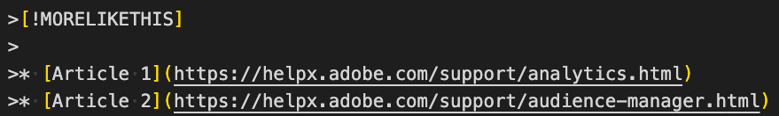

# Markdown語法樣式指南

本頁說明使用Markdown (.md)格式製作數位體驗技術檔案時的Markdown元件。 此頁面包含Adobe員工的詳細資訊。

EDS

請參閱此處： [Adobe.com](https://www.adobe.com/tw/){rel=nofollow}

<!--
* You can [view a basic sample file](sample.md) or [view a sample file with advanced syntax examples](sample-full.md)
-->

>[!TIP]
>
>觀看此[AdobeDocs Markdown影片](https://video.tv.adobe.com/v/26165)。

在大部分情況下，我們遵循標準的Git-Flavored Markdown (GFM)語法來格式化文字。 不過，部分語法（例如水平線）不受支援，而且我們已透過多種方式擴充Markdown，以符合檔案需求。

## 基本文字格式

使用Markdown時，段落不需要特殊語法。 在每個段落之間新增空白行。

若要將文字的格式設為&#x200B;**粗體**，請以兩個星號括住文字：

```
This text is **bold**.
```

若要將文字的格式設為&#x200B;*斜體*，請以單星號括住文字：

```
This text is *italic*.
```

若要將文字的格式同時設為&#x200B;***粗體與斜體***，請以三個星號括住文字：

```
This is text is both ***bold and italic***.
```

若要略過Markdown格式字元，請在該字元前使用`\`：

`This is not \*italicized\* type.`

已呈現：這不是\*斜體化\*型別。

## 徽章

進行中。 正在等候鎖定。

<!--

See the [dev version of this article](https://experienceleague-dev.corp.adobe.com/docs/authoring-guide-exl/using/markdown/syntax-style-guide.html#badges) for an example. Or [this one](https://experienceleague-dev.corp.adobe.com/docs/internal-test/test/badge.html).

There are two ways to create badges:

* **Metadata badge** - Specify the badge information in metadata so that the badge appears above the title in the article. This is especially useful for adding a badge to all articles in a guide or repo via the TOC.md or metadata.me files.
* **Inline badge** - Specify the badge information on its own line or in a heading, table, or other page element.


**Badge syntax**

*Metadata*: `badge: "Beta Content" type="Informative" url="https://www.example.com" tooltip="Go to example.com"`

*Inline*: `[!BADGE Beta Content]{type=Informative url="https://www.example.com" tooltip="Go to example.com"}`

**Examples**

```
|Type|Badge|
|---|---|
|Informative (default)|[!BADGE Beta]{type=Informative url="https://www.example.com"}|
|Positive|[!BADGE New Feature]{type=Positive url="https://www.example.com" tooltip="Go to example.com"}|
|Negative|[!BADGE Discontinued]{type=negative tooltip="This feature is now end of life"}|
|Neutral|[!BADGE Maybe]{type=Neutral tooltip="A rider fell off his horse..."}|
|Caution|[!BADGE Attention]{type=Caution tooltip="Yellow status"}|
```

**Rendered**

|Type|Badge|
|---|---|
|Informative (default)|[!BADGE Beta]{type=Informative url="https://www.example.com"}|
|Positive|[!BADGE New Feature]{type=Positive url="https://www.example.com" tooltip="Go to example.com"}|
|Negative|[!BADGE Discontinued]{type=negative tooltip="This feature is now end of life"}|
|Neutral|[!BADGE Maybe]{type=Neutral tooltip="A rider fell off his horse..."}|
|Caution|[!BADGE Attention]{type=Caution tooltip="Yellow status"}|

**More details**

* Only the badge label is required. The `type`, `url`, and `tooltip` parameters are optional. The `type` parameter determines the color. The `url` parameter lets users click the badge to open an article. The `tooltip` parameter displays the tooltip text on mouseover.
* If you want multiple badges to appear at the top of the page, use different badge names. For example, you can create badge names such as `badgeBeta` or `badgeWeb`. Example:

  ```
  badge1: "Beta"
  badge2: "Campaign Web"
  ```

* For metadata badges, make sure that all values are wrapped in quotes. For inline badges, make sure that `url` and `tooltip` are wrapped in quotes.
* Valid type values include *Informative* (default, blue), *Positive* (green), *Negative* (red), *Neutral* (dark gray), and *Caution* (yellow). 

-->

## 區塊引號

我們的編寫系統使用區塊引號語法（行首為`>`）來識別提示、附註和影片的自訂Markdown擴充功能。 您可以在段落前面加入`>`字元，以建立實際的區塊引號。

>這是區塊引號。

```
>This is a blockquote quotation.
```

## 程式碼區塊（內嵌）{#code-block}

**何時使用**

用於呈現一個內嵌在句子中的程式碼。 適合用來呼叫不需要完整包圍型程式碼區塊的Cookie名稱、檔案名稱、值或命令。

程式碼區塊中的內容呈現原樣且未本地化。 （此規則的唯一例外是`!UICONTROL`和`!DNL`語法，這些語法在封裝以供發佈期間被移除。）

也請將程式碼區塊用於不應驗證的範例URL： `https://www.example.com`

**語法**

程式碼區塊會使用單一反引號來括住您要反白顯示的程式碼元素。

```
This is `inline code` within a paragraph of text.
```

**範例**

This is `inline code` within a paragraph of text.

>[!TIP]
>
>您也可以使用三個反引號(&amp;amp；grave；&amp;amp；grave；&amp;amp；grave；)繞排文字，以建立內嵌程式碼區塊。 當您需要參考內嵌程式碼區塊中的反引號字元時，此功能特別實用。 範例：
>
&amp;amp；grave；&amp;amp；grave；&amp;amp；grave；`Use a back tick (`&amp;amp；grave；`) for formatting`&amp;amp；grave；&amp;amp；grave；&amp;amp；grave；

## 程式碼區塊（包圍型）

**何時使用**

使用程式碼區塊來顯示程式碼語法。 包圍型程式碼區塊會使用三個反引號來包圍您要反白顯示的程式碼元素。 在包圍型程式碼區塊的上方和下方新增空白行。

請注意，程式碼區塊不會本地化。

>[!TIP]
>
在建立包圍型程式碼區塊時指定語言。 指定語言時，會允許該語言特定的語法反白顯示，並顯示使用者的&#x200B;**Copy**&#x200B;按鈕。 如果您指定語言，也可以顯示行號。

**語法**

在程式碼行前後使用三個反引號(&amp;amp；grave；&amp;amp；grave；&amp;amp； )。 請確定開啟和關閉的倒勾號縮排相同的空格數。 為達到最佳呈現方式，請指定程式碼語言。

&amp;amp；grave；&amp;amp；grave；&amp;amp；grave；`javascript`

**範例**

```javascript
var visitor = Visitor.getInstance("INSERT-MARKETING-CLOUD-ORGANIZATION ID-HERE", {
     trackingServer: "INSERT-TRACKING-SERVER-HERE", // same as s.trackingServer
     trackingServerSecure: "INSERT-SECURE-TRACKING-SERVER-HERE", // same as s.trackingServerSecure

     // To enable CNAME support, add the following configuration variables
     // If you are not using CNAME, DO NOT include these variables
     marketingCloudServer: "INSERT-TRACKING-SERVER-HERE",
     marketingCloudServerSecure: "INSERT-SECURE-TRACKING-SERVER-HERE" // same as s.trackingServerSecure
});
```

### 程式碼區塊的語法醒目提示

Experience League 支援程式碼區塊的語法醒目提示。 確保在一組開頭的反引號後指定一種語言，例如 `java`，以確保正確醒目提示語法。 有關有效語言的清單，請參閱 [https://prismjs.com](https://prismjs.com/#supported-languages)。 如果缺少任何語言，請記錄 jira 票證。

### 程式碼區塊中的行號

在語言後面加上 `{line-numbers="true"}` 以啟用行號。

有行號的範例 (&grave;&grave;&grave;`html {line-numbers="true"}`)：

```html {line-numbers="true"}
<!DOCTYPE html>
<html>
<body>

<h1>My First Heading</h1>
<p>My first paragraph.</p>

</body>
</html>
```

**開始在行 _ 上編號**

在行號語法後面加上 `start-number="n"` 以從 1 以外的數字開始編號。

有新起始行的範例 (&grave;&grave;&grave;`html {line-numbers="true" start-line="7"}`)：

```html {line-numbers="true" start-line="7"}
<!DOCTYPE html>
<html>
<body>

<h1>My First Heading</h1>
<p>My first paragraph.</p>
<p>My second paragraph.</p>

</body>
</html>
```

### 程式碼區塊中的行醒目提示

在行號語法後新增 `highlight="n"` 以醒目提示程式碼區塊中的行。 指定 `11-13, 16` 將醒目提示第 11 行到第 13 行和第 16 行。

有醒目提示行的範例 (&grave;&grave;&grave;`html {line-numbers="true" start-line="7" highlight="11-13, 16"}`)：

```html {line-numbers="true" start-line="7" highlight="11-13, 16"}
<!DOCTYPE html>
<html>
<body>

<h1>My First Heading</h1>
<p>My first paragraph.</p>
<p>My second paragraph.</p>

</body>
</html>
```

### 程式碼區塊中的變數格式

程式碼區塊中不支援變數語法，例如`<i>italic</i>`。 若要指示變數文字，一個選項是使用角括弧`< >`。

## 可摺疊區段

您可以建立預設為隱藏的可摺疊區段（有時稱為&#x200B;**摺疊式功能表**）。 使用者可以按一下標題以展開或收合區段。

可摺疊文字可用來簡化複雜內容，例如簡化常見問題集頁面，或使用巢狀清單去除複雜程式的雜亂。 例如，您可以將子步驟收合到「檢視詳細資訊」區段中，而不顯示一組子步驟。

**語法**

```
+++See details
This is text inside a collapsible section.

* Bullet one
* Bullet two
* Bullet three

+++
```

**範例**

+++檢視詳細資料
這是可摺疊區段內的文字。

* 專案符號1
* 專案符號二
* 專案符號三

+++

**附註**

* 請勿在可摺疊區段中巢狀內嵌可摺疊區段。 巢狀可摺疊區段無法正確呈現。 但是，它們不會導致驗證失敗，因此使用者會看到巢狀區段的`+++`語法。
* 請確保在可摺疊區段內新增專案符號清單和程式碼區塊等專案上方和下方的空白行，否則會出現驗證錯誤。
* 您可以在可摺疊的區段中新增標題，但不建議這麼做。
* [摺疊式功能表不一定是桌上型電腦上複雜內容的答案](https://www.nngroup.com/articles/accordions-complex-content/)
* 可摺疊區段的一個歷史缺點是&#x200B;**在頁面**&#x200B;中尋找(Ctrl/Cmd+F)會忽略摺疊文字。 雖然這在Safari中仍為真，但在Chrome中不再為真；在頁面中尋找會偵測Chrome中的摺疊文字。
* 使用可摺疊區段的[維護更新](https://experienceleague.adobe.com/docs/workfront-known-issues/releases/current-updates.html?lang=en)頁面的範例。

## 註解與註解

註解不會出現在演算後的說明系統中。 使用註解為自己或其他作者留下註解。 您也可以對文字的草稿區段使用註解。

如需評論，請記住，雖然未在說明系統中轉譯這些評論，但編輯GitHub.com上Markdown檔案的使用者仍可看見這些評論。 請勿在註解中包含機密資訊。

```
<!-- standard comment code -->

DO NOT USE the following:
<!--> bad comment syntax <-->
```

除非您正在編輯檔案，否則您應該無法看見此檔案下方的文字（「您無法看見我」）。

<!--
You can't see me (unless you're editing in Git).
-->

**提醒：**&#x200B;公開說明文章中未出現註解（備註）。 不過，若是使用者可以查看與編輯的公開 Markdown 檔案，就會顯示註解。

>[!IMPORTANT]
>
避免在區塊元件（例如專案符號清單）中新增註解，尤其是巢狀專案符號清單。 註解可變更專案符號清單的呈現方式。
>
在TOC.md檔案中，請勿註釋掉TOC清單中間的行。 這可能會破壞目錄清單，並導致驗證錯誤。 請改為將目錄中的註解移至檔案結尾。

## CONTEXTUALHELP

作者可與產品團隊合作，在Experience Cloud或Experience Platform產品UI中新增說明彈出視窗。 範例：

```markdown
>[!CONTEXTUALHELP]
>id="platform_destinations_activate_mandatorykey_4"
>title="About mandatory attributes"
>abstract="Select the XDM schema attributes that all exported profiles should include. Profiles without the mandatory key are not exported to the destination. Not selecting a mandatory key exports all qualified profiles regardless of their attributes."
>additional-url="http://www.adobe.com/go/destinations-mandatory-attributes-en" text="Learn more in documentation"
```

## 定義清單

對於定義清單，我們尚未支援標準Markdown語法。 請改用手動格式設定，例如：

```
**Frog** - An amphibious green creature. Likes flies.
```

轉譯：

**青蛙** — 兩棲綠色生物。 喜歡蒼蠅。

<!--
A definition list is a Markdown extension that supports the Definition List component in AEM. A definition list consists of a term and its definition.

**When to use**

Using a definition list is optional. To define lists of features or options, you can use either the definition list syntax or use basic Markdown formatting, such as applying bold to option names.

**Syntax**

```
Frog
: An amphibious green creature. Likes flies.

Cat
: A less amphibious creature than frogs.
```

**Example**

Frog
: An amphibious green creature. Likes flies.

Cat
: A less amphibious creature than frogs.
-->

## 下載檔案

上傳.zip或其他可下載的檔案至assets目錄，然後連結至該目錄。 如果是.zip檔案，按一下連結即可下載檔案。 如果檔案型別(例如PDF或PNG)可以在瀏覽器中開啟，則按一下連結會開啟一個新索引標籤。 對於這類檔案，請考慮壓縮檔案，或提供以滑鼠右鍵按一下連結並下載的指示。

`Download` &amp;amp；lbrack；`download-test.zip`&amp;amp；rbrack；`(assets/download-test.zip)`

轉譯：

下載[下載測試zip](assets/download-test.zip)

>[!NOTE]
>
下載檔案和影像的最大檔案大小為100 MB。 這是github.com的上限。 git.corp.adobe.com限制較高(250 MB)，但我們需要能夠將檔案複製到github.com映象。

## 標題 {#headings}

在Markdown中，您可以使用井字型大小(`#`)來識別標題層級。 第一個層級(`#`)是文章標題，中繼資料標題中也指定了文章標題 — 請保持這些相同。 第二層級(`##`)代表頁面上將包含在迷你目錄中的主要標題。 如果您習慣於AEM (chl-author)的撰寫方式，第2層標題(`##`)會對應至AEM中的「標題1」元件。

標題的字元數上限：69個字元（英文） / 120個字元(LOC)。

```
# This is level 1 (article title)

## This is level 2
   
### This is level 3
```

**標題最佳實務**

* 請確定每篇文章的中繼資料後面有層級1標題(`#`)緊跟在空白行後面。
* 請勿略過層級，例如從層級2 (`##`)跳至層級4 (`####`)。
* 每個標題在&#x200B;*之前*&#x200B;和&#x200B;*之後*&#x200B;加入空白行。
* 如果標題包含數字，請指定不以數字開頭的明確標題識別碼，例如`## Release notes for 2016 {#release-notes-2016}`。
* 我們建議僅使用3個標題層級。 層級4及更高層級目前未正確呈現。
* 標題會顯示在右側導覽中，方便使用者按一下以跳至區段。 依預設，右側導覽中顯示兩個層級的標題。 若要變更層級數目，請使用`mini-toc-levels`中繼資料，例如`mini-toc-levels: 3`。

**標題ID**

標題ID （也稱為&#x200B;*錨點ID*）可用來建立文章內章節的自訂深層連結。 若要指定標題ID，請使用此格式：

```
## Creating processing rules {#processing-rules}
```

標題ID應小寫並加上連字。

如果您未指定標題的標題ID，預設標題ID會是「縮寫」（小寫加連字）標題。 例如，`## Creating widgets and Such`標題將有`#creating-widgets-and-such`錨點。

## HTML語法 {#html}

基於安全性和協助工具等各種原因，我們限制了Markdown中可以使用的HTML語法。 下列清單顯示支援的HTML語法。 任何不在此清單中的HTML語法都會導致驗證錯誤。

```html
<table>
<tbody>
<td>
<tfoot>
<thead>
<th>
<tr>
<col>
<colgroup>
<p> (paragraph break)
<ul> (unordered list / numbered list)
<ol> (ordered list / bullet list)
<li> (list item)
<br> (line break)
<b>
<caption>
<i>
<strong> (bold)
<u> (underline)
<s> (strikethrough)
<span>
<sub> (subscript)
<sup> (superscript)
<a>

<div>
<em> (emphasis, italics)
<pre> (codeblock)
<code>
<codeblock>
```

<!--
Bob: Check above no space char. (ignore the space; I can't add a codeblock inside this codeblock)
-->

如果您想要將HTML語法新增到此清單中，請記錄票證或聯絡SSE團隊。

## 影像 {#images}

使用影像的``語法。 括弧`[ ]`包含替代文字，括弧`( )`包含影像位置和選用的暫留文字（工具提示）。 驚歎號可區分影像與連結。

```

```


針對共用影像，您可以將影像放在根資產資料夾中，然後使用可從存放庫內任何檔案運作的根連結：

```
/help/assets/imagename.png
```

### 調整影像大小和對齊

**影像屬性（含右對齊的影像）** {align="right"}

使用如下列的語法，變更預設影像寬度或在頁面檢視或表格儲存格內將影像置中或靠右對齊。

```
{width="300" align="center"}
```

轉譯：

Bob — 寬度=下方300畫素

{width="300" align="center"}

* 如果是大型影像，建議您建立足夠大的影像，以縮小並符合頁面寬度（至少640畫素寬）。 建議的寬度為1500畫素。 不需要建立大於2500畫素或500 KB的影像。 影像的最大檔案大小為100 MB。
* 對於小型影像，請使用所需的寬度（畫素）建立影像，或使用寬度引數，例如`{width="250"}` （畫素）或`{width="50%"}` （檢視區域的百分比，而非原始影像大小）。 影像會依比例縮放。 請注意，影像可以放大或縮小，因此請注意畫素化。
* 在某些情況下，來自相同介面的影像在頁面上看起來會不成比例，因為較寬的影像（例如工具列）會縮減，而較窄的影像（例如面板）則不會縮減。 在這種情況下，請考慮縮小較寬的影像，以改善視覺一致性。
* 您可以在檢視區域中變更影像的對齊方式。 使用`{align="center"}`或`{align="right"}`。 不支援`valign`引數。

>[!NOTE]
>
影像的最大檔案大小為100 MB。 這是github.com的上限。 git.corp.adobe.com限制較高(250 MB)，但我們需要能夠將檔案複製到github.com映象。

### 影像連結

如果您想要允許使用者按一下影像以跳至其他頁面，請使用此格式。

**語法**

```
[](https://www.adobe.com)
```

**範例**

按一下此影像，即可前往Adobe網站。

[](https://www.adobe.com/tw/)

### 按一下即可縮放影像

使用`zoomable`引數可讓使用者按一下影像，以檢視影像的放大版本。 當使用者將滑鼠移到可縮放的影像上時，指標會變成放大鏡。 按一下時，影像會展開至瀏覽器的完整寬度。 您可以使用關閉按鈕將其關閉。

**範例**

{width="100" zoomable="yes"}

**語法**

```
{width="100" zoomable="yes"}
```

## 連結和交叉引用 {#links-and-cross-references}

外部連結為直接連結，可呈現為連結標題或純URL。

```
[Adobe](https://www.adobe.com)
```

轉譯：

[Adobe](https://www.adobe.com/tw/)

如果您將URL直接新增至文字，URL不會自動轉換為連結。 若您希望URL顯示為連結，請新增`< >`語法。 範例：

```
https://www.adobe.com

<https://www.adobe.com>
```

轉譯：

https://www.adobe.com/tw/

<https://www.adobe.com>

文章連結（交叉參照）可能比較複雜。

**選項1：標準相對連結**

以下是標準相對連結的外觀：

```
See [Overview example article](collaborative-doc-instructions/overview.md)
```

路徑名稱必須同時說明來源檔案和目標檔案的位置。 您可以使用所有相對連結運算元，例如`./` （目前目錄）、`../` （上一個目錄）和`../../` （上一個目錄）。

**選項2：根相對連結**

這種連結型別的優點是，它只需要說明目標檔案。 它可從存放庫中的任何來源檔案運作，無論來源檔案位置為何。

```
/help/using/docile-rules/introduction.md
```

**深層連結**

若要連結至文章中的標題，目標標題必須具備明確的標題ID （也稱為「錨點ID」）。 範例：

`## Creating audience segments {#creating-audience-segments}`

若要在同一頁面中連結至此標題，請使用標題ID作為連結：

`See [Creating audience segments](#creating-audience-segments)`

若要從存放庫中的不同文章連結至此標題，請在連結結尾處新增標題ID尾碼：

`See [Audiences: Creating audience segments](audiences.md#creating-audience-segments)`

**在新標籤中開啟**

如果您想要連結開啟新標籤，例如跳至其他節目表時，請使用連結中的`{target="_blank"}`屬性。

範例：

`[See What's new](whats-new.md){target="_blank"}`

## 中繼資料

將中繼資料新增至Markdown檔案頂端。 中繼資料行（和空白行）之後的下一行必須是文章標題（#標題）。

```
---
title: Title for search optimization
description: This is the article description used for search optimization. Use common search keywords and synonyms.
---

# Article title
```

## 本地化標籤： UICONTROL、DNL和DONOTLOCALIZE

我們所有 Markdown 說明內容一開始會使用機器翻譯工具來進行本地化。 如果說明內容從未進行過本地化，那麼我們將保留機器翻譯。 但是，如果說明內容過去已經進行過本地化，那麼機器翻譯的內容將充當預留位置，而內容部分則在進行人工翻譯中。

## 類似項目

使用「類似專案」元件在文章結尾顯示相關連結。 轉譯後，MORELIKETHIS元件會轉譯為「相關文章」（並以其他語言翻譯）。

**語法**



**範例**

>[!MORELIKETHIS]
>
* [Article 1](https://helpx.adobe.com/tw/support/analytics.html)
* [Article 2](https://helpx.adobe.com/tw/support/audience-manager.html)

## 附註/警告

我們擴充Markdown功能，以格式化各種型別的附註：附註、提示、重要和警告。

**語法**

```
>[!NOTE]
>
>This is a standard NOTE block.
```

**範例**

>[!NOTE]
>
這是一個標準的備註區塊。

**語法**

```
>[!TIP]
>
>This is a standard tip.
```

**範例**

>[!TIP]
>
這是一個標準技巧。

**語法**

```
>[!WARNING]
>
>This is a standard warning block.
```

**範例**

>[!WARNING]
>
這是標準的警告區塊。

**語法**

```
>[!IMPORTANT]
>
>This is a standard important block.
```

**範例**

>[!IMPORTANT]
>
這是標準的重要區塊。

**語法**

```
>[!NOTE]
>
>This is a standard NOTE block.
>
>It includes multiple paragraphs.
```

**範例**

>[!NOTE]
>
這是一個標準的備註區塊。
>
其中包含多個段落。

新支援的附註型別：

>[!ADMIN]
>
這是管理員注意事項。 僅 EXL。

>[!AVAILABILITY]
>
這是可用性備註。 僅 EXL。

>[!PREREQUISITES]
>
這是先決條件備註。 僅 EXL。

>[!INFO]
>
這是一則資訊備註。 僅 EXL。

>[!ERROR]
>
這是一個錯誤備註。 僅 EXL。

>[!SUCCESS]
>
這是一個成功備註。 僅 EXL。

## 編號清單與專案符號清單 {#lists}

若要建立編號清單，請在文字行的開頭使用`1.`或`1)`，但請挑選一種方法，並在文章中一致使用。 您不必指定編號， GitHub 會自動完成編號工作。

編號清單中的每個步驟都使用編號`1`。

在清單前後新增空白行。

**語法**

```
1. This is step 1.

1. This is the next step.

   1. This is a sub-step

   1. This is a sub-step

1. This is yet another step, the third.
```

**範例**

1. This is step 1.

   1. 子步驟

   1. 子步驟

1. This is the next step.

1. This is yet another step, the third.

若要建立專案符號清單，請在文字行的開頭使用`*`、`-`或`+`，但請挑選一種方法，並在文章中一致使用。 （如果您混合使用格式，例如`*`和`+`，則在簽入檔案時，將會出現Markdown驗證錯誤。）

**最佳實務：**&#x200B;使用`*`作為專案符號。 Visual Studio Code會套用星號當作專案符號，因此使用星號來自動建立未排序清單會比較容易。 (您可能已注意到TOC.md檔案在清單中使用加號`+`。 這是移轉的遺留問題。 任何有效的專案符號字元只要在文章中一致即可。)

**語法**

```
* First item in an unordered list.
* Another item.
* Here we go again.
```

**範例**

* First item in an unordered list.
* Another item.
* Here we go again.

您也可以在清單中內嵌清單，並在清單專案之間新增內容。 在清單專案之間縮排內容，以避免啟動新清單。 步驟之間的專案應縮排至文字的開頭 — 編號清單有3個空格，專案符號清單有2個空格。

```
1. Set up your table and code blocks.
1. Perform this step.

   
   
1. Make sure that your table looks like this: 

   | Hello | World |
   |---|---|
   | How | are you? |
   
1. This is the fourth step.

   >[!NOTE]
   >
   >This is note text.
   
1. Do another step.

   This is an indented line.
```

**範例**

1. Set up your table and code blocks.
1. Perform this step.

   

1. Make sure that your table looks like this:

   | Hello | World |
   |---|---|
   | How | are you? |

1. This is the fourth step.

   >[!NOTE]
   >
   This is note text.

1. Do another step.

   這是縮排行。

注意：如果您太深入縮排，例如6個空格而非3個，則該行中的內容會被視為程式碼區塊。

## 陰影方塊

「陰影」方塊可用來從頁面其餘部分設定內容的區段。 例如，Workfront團隊想要新增包含文字、影像和程式碼範例的「範例」方塊來達成特定目的。 對於「自行」或「使用案例」區段，或是擴充的附註或秘訣，陰影方塊可能也很實用。

若要建立陰影方塊，請在區段開頭新增`>[!BEGINSHADEBOX]`，並在結尾新增`>[!ENDSHADEBOX]`。 這些開始和結束標籤之間的所有內容都將具有灰色背景。 新增標籤至`BEGINSHADEBOX` (例如`>[!BEGINSHADEBOX "Use Case]`是建立粗體陰影方塊標題的選用方式。 您也可以在下一行新增粗體文字或標題。

範例：

>[!BEGINSHADEBOX]

**正在移除HTML資料表中的框線**

在某些情況下，您可以使用HTML表格來建立平衡的設計，但您不希望內容看起來像表格。 若要關閉單列HTML表格的框線，請使用下列語法：

```
<table>
<tr style="border: 0;">
```

>[!NOTE]
>
請勿過度使用。 對於一般表格，我們希望在不同內容之間保持一致設計。


在三欄表格中，您也可以新增`<td align="center">`和`<td align="right">`，將儲存格內容平均分配到檢視區域。 如果不是的話，我早就告訴過你了。

這是著色方塊的最後一行。

>[!ENDSHADEBOX]

## 代碼片段及

若要在存放庫中的文章之間共用文字，您可以在`help`資料夾中建立`_includes`資料夾。 此`_includes`資料夾可以有.md檔案，這些檔案可以從存放庫中的其他檔案參照（包含）。 此外，此存放庫中的`snippets.md`檔案可以包含可從存放庫中的任何檔案參照的Head2錨點。

snippets.md檔案中的H2參考： `{{id-name}}`

參考以包含檔案： `{{$include /help/_includes/filename.md}}`

## 表格

表格在Markdown中可能會產生問題。 從先前的編寫系統移轉表格時，簡單表格（每個儲存格一行）會格式化為原生Markdown表格（偏好設定）。 更多進階表格會格式化為HTML。

>[!TIP]
>
觀看[Markdown表格影片](https://video.tv.adobe.com/v/26220)

原生表格在Markdown中通常看起來更好。 欄會根據其內容調整大小。 HTML表格會以等寬欄呈現。

依預設，Markdown的儲存格不支援多行或清單。 不過，我們已擴充Markdown表格，可允許儲存格中有多行（使用`<p>`或`<br>`）或基本清單（使用`<ul><li>`等）。

>[!IMPORTANT]
>
將這些HTML程式碼新增至Markdown表格時，請務必小心。 如果您的語法不正確，則會出現無法準確描述問題的令人困惑的驗證錯誤。 請檢查您的HTML語法，確認其格式正確。

任何表格均不允許： iframe、儲存格範圍、內嵌表格。

原生Markdown表格中不允許：巢狀或複雜清單。

檢視[資料表](tables.md)

**語法**

```
| Header | Another header | Yet another header |
|--- |--- |--- |
| row 1 | row 1 column 2 | row 1 column 3 |
| row 2 | row 2 column 2 | row 2 column 3 |
```

**範例**

| Header | Another header | Yet another header |
|--- |--- |--- |
| row 1 | row 1 column 2 | row 1 column 3 |
| row 2 | row 2 column 2 | row 2 column 3 |

Markdown 要呈現簡單的表格沒有問題。 不過，若表格的儲存格內包含多個段落或清單，就會難以呈現。 如果是這類內容，建議您使用其他格式，例如改為標題與文字。

**含有段落分隔符號和清單的Markdown表格**

```
| Header | Another header | Yet another header |
|------------|----------|----------------|
| row 1 | first paragraph in cell<p>second paragraph in cell(`<p>`)<br>line break (`br`) | row 1 column 3 |
| row 2 | bullet list<ul><li>item 1</li><li>item 2</li><li>item 3</li></ul> | row 2 column 3 |
```

**範例**

| Header | Another header | Yet another header |
|------------|----------|----------------|
| row 1 | 儲存格中的第一段<p>儲存格(`<p>`)<br>分行符號(`br`)中的第二個段落 | row 1 column 3 |
| row 2 | 專案符號清單<ul><li>專案1</li><li>專案2</li><li>專案3</li></ul> | row 2 column 3 |

**含有分行符號和假清單的Markdown表格**

使用手動專案符號的因應措施。

```
| Color | Things to Do |
|--- |--- |
| Red | * Read <br> * Write <br> * Study |
| Blue | * Swim <br> * Run <br> * Lift <br> **Note**: Remember to train smart.|
```

**範例**

| 顏色 | 要做的事 |
|--- |--- |
| 紅色 | *讀取<br> *寫入<br> *研究 |
| 藍色 | *游泳<br> *執行<br> *提升<br> **附註**：請記得訓練智慧型。 |


## 索引標籤

標籤是位於區段頂端的可點按區域，可顯示不同的內容。 當按一下標籤時，會顯示標籤的內容，而其他標籤的內容則會隱藏。

若要建立索引標籤組，請在索引標籤組的開頭新增`>[!BEGINTABS]`，並在最後一個索引標籤後新增`>[!ENDTABS]`。 為每個標籤區段新增`>[!TAB <tab title>]`個標籤，並在其下方新增每個標籤的內容。

**Tab語法**

```
>[!BEGINTABS]

>[!TAB iOS]

This content appears in the iOS tab.

>[!TAB Android]

This content appears in the Android tab.

>[!TAB Windows]

This content appears in the Windows tab.

>[!TAB MacOS]

This content appears in the MacOS tab.

>[!TAB Linux]

This content appears in the Linux tab.

>[!ENDTABS]
```

**已呈現**

>[!BEGINTABS]

>[!TAB iOS]

此內容會顯示在iOS標籤中。

>[!TAB Android]

此內容會顯示在Android標籤中。

>[!TAB Windows]

此內容會顯示在Windows標籤中。

>[!TAB MacOS]

此內容會顯示在MacOS標籤中。

>[!TAB Linux]

此內容會顯示在Linux標籤中。

>[!ENDTABS]

**標籤備註**

* 使用者無法使用頁面內搜尋(Ctrl+F/Cmd+F)來找出未顯示索引標籤中的內容。
* 如果標籤標題超過使用者瀏覽器中的頁面檢視寬度，則會出現水準卷軸。
* 您無法格式化索引標籤標題。 您新增的任何語法都會當作標題的一部分傳遞。 例如，`>[!TAB **iOS**]`將顯示為`**iOS**`。
* 您可以在頁面上建立多個標籤組，但不能在另一個標籤組中巢狀內嵌標籤組。
* 陰影背景會套用至標籤集，讓使用者可以看到標籤內容與其他內容之間的差異。

## 文字醒目提示

Workfront 團隊希望能夠使用黃色醒目提示來指示即將推出的功能預覽。這是它的運作原理。

範例：

```
This entire paragraph should NOT be highlighted. <span class="preview"> This word is **bold** inside a highlighted sentence.</span> And this is just the last sentence.
```

轉譯：

整個段落不應醒目提示。<span class="preview"> 該單字在醒目提示的句子中為&#x200B;**粗體**。</span> 而這只是最後一句。

一般來說，請使用`<span class="preview">`反白標示段落中的段落或文字，並為多個段落和元件使用`<div class="preview">`。

>[!NOTE]
>
我們仍在努力改善某些頁面元素（例如附註和表格）的醒目顯示效果。 如果您看到不適當的呈現，請隨時記錄JIRA錯誤。 進行中。
>
VSC預覽尚未支援反白顯示。

## 影片

原本不會在Markdown中轉譯影片。 若要顯示內嵌視訊，請使用元件指示器`[!VIDEO]`，然後使用URL。

**語法**

```
>[!VIDEO](https://video.tv.adobe.com/v/29770/?quality=12)
```

**範例**

>[!VIDEO](https://video.tv.adobe.com/v/29770/?quality=12)

## 其他Markdown語法資訊

### Markdown延伸元件

我們需要擴充Markdown功能，以支援一般Markdown中未包含的專案。

特殊元件會使用方括弧和驚歎號，加上區塊型別參照，在包含區塊引號中宣告。 例如，以下說明如何宣告註記：

```
>[!NOTE]
>
>This is a note.
```

* 附註（警告），包括附註、重要、提示、警告和警告
* 內嵌視訊
* 更多相關資訊（相關文章）
* 適用於本地化的各種UI標籤
* 標題、影像和程式碼區塊的元件屬性
* 可摺疊區段
* 文字醒目提示
* 頁面索引標籤

在每行的開頭使用Markdown區塊引號( `>`)，繫結段落元件（例如備註）。 若要改善預覽，請在區段開頭後立即新增只有區塊引號符號(`>`)的一行。 若要結束截面，請新增空白行。

如果您需要在元件內使用子元件，請為該子元件區段新增額外層級的區塊引號(`>  >`)。 例如，DONOTLOCALIZE區段中的NOTE應該以`>  >`開頭。

某些情況下，我們需要支援Markdown元素（例如標題）的特定設定。 如果您需要變更預設設定，請在元件之後新增引數，並置於大括弧`{# }`中。

### 空白行

您可以用空白行將一些呼吸空間加入文字的牆壁中。 使用`<br>&nbsp;`作為因應措施，以新增空白行。

範例：這是可能非常長的文字的第一句。 讓我在此段落與下一個段落之間插入一個空白行。

<br>

這裡看起來可能不是很吸引人，但當你覺得頁面太擁擠時，請嘗試使用空白行。

### 要「逸出」的字元 {#characters-to-escape}

數個字元(`# { } [ ] < > * + - . !`)在Markdown或HTML中有特殊的意義，可用來建立標題、影像、清單和其他元件。 當您使用這些字元時，轉譯引擎會認為您正在新增程式碼。 但是，在某些情況下，您要在文字中顯示這些字元。 若要這麼做，您必須「逸出」字元。 最簡單的逸出方法是在字元前面加上反斜線(`\`)。 例如，如果您想要以`#`字元作為行首，以免解譯為標題，您可以輸入`\#`：

`\# This is not a heading`

**已轉譯：**

\#這不是標題

反斜線只適用於下列字元： `# { } [ ] * + - . !`。 如果您需要逸出角括弧（例如`<yourname>`）等字元，您可以用反引號將文字括住以套用內嵌程式碼區塊，或使用HTML實體程式碼而非字元。 常見HTML程式碼範例：

* `&lt;` (&lt;)
* `&gt;` (>)
* `&amp;` (&amp;)
* `&Hat;` (^)
* `&mdash;` (—)
* `&ndash;` (-)

[Freeformatter網站](https://www.freeformatter.com/html-entities.html)提供HTML實體的完整清單。 這可讓您查詢所有特殊字元。

>[!NOTE]
>
對於鏈結步驟，例如「選擇檔案>另存新檔」，您不需要逸出`>`字元，因為它不在其他字元旁邊。 對於變數（例如`<filename>`），您會想要使用程式碼區塊`backticks`或字元程式碼(`&lt;filename&gt;`)來逸出角括弧。

如果您在程式碼區塊中使用HTML實體，則實體文字不會轉換為特殊字元。 例如，`&gt;`在程式碼區塊中顯示為&quot; `&gt;`&quot;而非&quot; > &quot;。

若要逸出反引號( &amp;amp；grave； )，請使用`&grave;`，或在包住內嵌程式碼區塊的三個反引號內插入反引號。

### 不支援的專案

有幾個Git口味的Markdown專案我們不打算支援。 您使用的預覽工具可能會啟用其中的部分功能，但並非仰賴此功能。

**工作清單**

不支援

```
* [x] Set up Jersey Shore recording
* [x] Buy donuts with sprinkles
* [x] Take nap
* [ ] Wash ferret
```

**表情符號**

不支援

```
:bowtie:
```

**水平線**

不支援

```
***
```

**封鎖引號**

我們使用區塊引號（`>`在一行的開頭）來表示延伸Markdown語法，例如附註和影片，如下所述。 但您也可以使用`>`語法來建立區塊引號區段。

>[!NOTE]
>
如果您過度縮排，例如六個空格而不是三個空格，內容會呈現為區塊引號。 請使用適當的縮排量，以避免內容錯誤地呈現為區塊引號。
