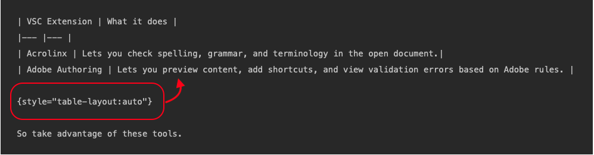

# 表格

Matt一次又一次地來到這裡 — 

EDS

標準Markdown僅支援基本表格。 若為AdobeDocs Markdown，您有以下選項：

* 基本Markdown表格
* HTML表格
* 使用有限段落分隔符號HTML語法的Markdown表格(`<p>`)，分行符號(`<br>`)以及基本清單(`<ul>`， `<ol>`)。

## 將HTML表格轉換為Markdown表格

在某些情況下，您會想要將HTML表格轉換為Markdown表格或Markdown文字。 您可能需要改善外觀、解決驗證錯誤，或讓日後編輯更容易。

很可惜，我們找不到可轉換HTML表格的單一工具。 我們通常使用工具組合，拼湊出不錯的Markdown表格。

| 工具 | 作用 |
|--- |--- |
| [Markdown表格產生器](https://www.tablesgenerator.com/markdown_tables) | 適合從頭開始建立Markdown表格。 |
| [進階表格轉換工具](https://tableconvert.com/html-to-markdown) | 將表格從任何格式轉換為任何格式。 <p>**注意：** 轉換時，連結和影像會平面化。 |
| [基本表格html > markdown轉換工具](https://jmalarcon.github.io/markdowntables/) | 簡單HTML轉換工具 <p>**注意：** 轉換時，連結和影像會平面化。 |
| [非表格HTML> Markdown轉換工具](https://codebeautify.org/html-to-markdown) | 將HTML表格轉換為非表格Markdown語法。 與上述工具搭配使用，可複製連結、影像及任何其他平面化專案。 |

## 基本Markdown表格

* 請務必在決定表格屬性的第二列中至少新增三個連字型大小。 範例： `|--- |--- |--- |` 用於3欄表格。
* Markdown表格必須至少有一個標題列和一個內文列。 您無法建立單列或單儲存格Markdown表格(請改用HTML)。
* 請確定每一列的垂直號( &amp;vert； )字元數目相同。 如果您需要在表格儲存格中加入垂直號字元，請在字元前面加上反斜線(`\|`)或使用HTML實體代碼(`&vert;`)。
* 在表格中使用程式碼區塊時請務必小心。 內嵌程式碼區塊可能會導致欄寬不成比例。
* 您可以透過指定「自動」或「固定」來變更表格的呈現方式。 另請參閱 [變更表格的呈現方式](#table-rendering).

## 使用額外的HTML建立Markdown表格

為方便移轉，我們已擴充Markdown表格，以支援HTML分段功能(`<p>`)，分行符號(`<br>`)和基本HTML清單(`<ul>` 和 `<ol>`)。

**含有分行符號和清單的Markdown表格**

```
| Header 1 | Header 2 | Header 3 |
|--- |--- |--- |
| Normal row | row 1 column 2 | row 1 column 3 |
| Line break | first line in cell<br>second line in cell | row 1 column 3 |
| Bullet list | Bullet list:<ul><li>Item 1</li><li>Item 2</li><li>Item 3</li></ul> | row 2 column 3 |
| Bullet list with line break | Bullet list:<ul><li>Item 1</li><li>Item 2</li><li>Item 3</li></ul><br>This is a new line after the bullet list | row 2 column 3 |
```

**範例**

| 頁首1 | 頁首2 | 頁首3 |
|--- |--- |--- |
| 正常列 | row 1 column 2 | row 1 column 3 |
| 分行符號 | 儲存格中的第一行<br>儲存格中的第二行 | row 1 column 3 |
| 專案符號清單 | 專案符號清單：<ul><li>項目 1</li><li>項目 2</li><li>項目 3</li></ul> | row 2 column 3 |
| 具有分行符號的專案符號清單 | 專案符號清單：<ul><li>項目 1</li><li>項目 2</li><li>項目 3</li></ul><br>這是專案符號清單之後的新行 | row 2 column 3 |

>[!IMPORTANT]
>
>如果您決定在原生表格中使用HTML，請務必使用正確的HTML語法。 HTML語法中的錯誤會導致驗證錯誤，難以理解。 仔細檢查您的工作。

## 使用HTML表格

移轉工具嘗試儘可能保留原始表格的格式。 此HTML語法的大部分都會被忽略，而此語法的一部分會導致驗證錯誤。

**已移轉HTML表範例**

```
<table> 
 <tbody>
  <tr>
   <th>Property</th> 
   <th>Type</th> 
   <th>Value Description</th> 
  </tr>
  <tr>
   <td>badgingPath</td> 
   <td>String[]</td> 
   <td><p><i>(Required)</i> A multi-value string of badge images up to the number of badgingLevels. The badge image paths must be ordered so the first is awarded to the highest expert. If there are less badges than indicated by badgingLevels, the last badge in the array fills out the rest of the array. Example entry:</p><p> <code>/etc/community/badging/images/expert-badge/jcr:content/expert.png</code></p></td> 
  </tr>
  <tr>
   <td>badgingLevels</td> 
   <td>Long</td> 
   <td><i><p>(Optional)</i> Specifies the levels of expertise to be awarded. For example, if there should be an <code>expert </code>and an <code>almost expert</code> (two badges), then the value should be set to 2. The badgingLevel should correspond with the number of expert-related badge images listed for the badgingPath property. Default is 1.</p></td> 
  </tr>
  <tr>
   <td>badgingType</td> 
   <td>String</td> 
   <td><p><i>(Required)</i> Identifies the scoring engine as either "basic" or "advanced". Set to "advanced" else the default is "basic".</p></td> 
  </tr>
 </tbody>
</table>
```

**已呈現**

<table> 
 <tbody>
  <tr>
   <th>屬性</th> 
   <th>類型</th> 
   <th>值說明</th> 
  </tr>
  <tr>
   <td>badgingpath</td> 
   <td>String[]</td> 
   <td><p><i>（必要）</i> 徽章影像的多值字串，最多badgingLevels個數。 徽章影像路徑必須排序，才能將第一個授予最高的專家。 如果徽章數量少於badgingLevels所指示的數量，則陣列中的最後一個徽章會填滿陣列的其餘部分。 範例專案：</p><p> <code>/etc/community/badging/images/expert-badge/jcr:content/expert.png</code></p></td> 
  </tr>
  <tr>
   <td>badgingLevels</td> 
   <td>長</td> 
   <td><p><i>（可選）</i> 指定要授與的專業知識等級。 例如，如果應該有 <code>expert </code>和 <code>almost expert</code> （兩個徽章），則值應設為2。 badgingLevel應該與badgingPath屬性所列的專家相關徽章影像數量相對應。 預設值為1。</p></td> 
  </tr>
  <tr>
   <td>badgingtype</td> 
   <td>字串</td> 
   <td><p><i>（必要）</i> 將評分引擎識別為「基本」或「進階」。 設為「進階」，否則預設為「基本」。</p></td> 
  </tr>
 </tbody>
</table>

**何時使用HTML表格**

* 若要平衡欄，請執行下列動作：
* 若要省略表格標題（Markdown表格必須有標題列）：
* 若要移除單清單格的框線(`<tr style="border: 0;">`)。
* 新增欄或列範圍。
* 對齊表格儲存格內的文字。

**使用HTML表格的注意事項**

* 請勿在HTML表格中使用Markdown語法。 例如，如果您加入 `[!NOTE]` 至HTML表格，將依原樣呈現(`[!NOTE]`)。 請改用HTML語法來處理像是附註和影像等專案。

  鎖定標籤是此規則的例外，因為在轉譯頁面之前，UICONTROL和DNL標籤會被移除。

* 表格中並非所有HTML語法都受支援。 在EXL中轉譯時，會忽略寬度、高度、顏色和其他HTML語法元素。 您可以保留這些值，除非它們會導致驗證錯誤。
* 若要對齊文字，請使用 `align: "left|center|right"` 在HTML中。 例如，若要將表格儲存格的內容置中，請使用 `<td align="center">`.
* HTML表格不能包含巢狀表格。

>[!TIP]
>
>如果要關閉單列HTML表格的邊框，請使用下列語法：
>
>```
><table>
><tr style="border: 0;">
>```

## 指定如何呈現表格 {#table-rendering}

我們可以使用兩種方式呈現表格：

* **固定** （目前為預設值） — 包含轉譯表格的自訂規則，包括含有影像的HTML表格。 表格會呈現為完整寬度，但不進行捲動，這有時會導致文字重疊。
* **自動**  — 類似Git-flavored Markdown (GFM)。 表格可捲動，因此文字不會重疊。

在大多數情況下，表格會以相同外觀呈現。 不過，如果您的表格包含重疊文字，您會想要套用 `auto` 標籤之間。 或者，如果含有影像卡的HTML表未正確呈現，您可能想要套用 `fixed` 標籤之間。

我們正在考慮將預設值從 `fixed` 至 `auto`.

## 編輯Markdown表格

如果您想要指定原生Markdown表格的呈現方式，請在表格後面新增以下其中一個語法行，並在前後加上空白行：

* `{style="table-layout:auto"}`
* `{style="table-layout:fixed"}`



### 編輯HTML表格

如果要指定HTML表格的呈現方式，請在表格的第一行中使用以下語法行之一：

* `<table style="table-layout:auto">`
* `<table style="table-layout:fixed">`

```
<table style="table-layout:fixed">
  <tr>
    <th>Month</th>
    <th>Savings</th>
  </tr>
  <tr>
    <td>January</td>
    <td>$100</td>
  </tr>
</table>
```

### 何時使用自動或固定

**重疊文字**

使用 `auto` 針對具有長程式碼區塊或文字的表格，造成文字重疊時 `fixed` （預設）已選取。

*固定（預設）*

| 分析量度 | 說明 | ID查詢引數 |
| ---- | ---- | ---- |
| **timeseries.data.collection.validation.category.type.count** | 一個資料集或所有資料集的無效「型別」訊息總數。 | 資料集ID |
| **timeseries.data.collection.validation.category.range.count** | 一個資料集或所有資料集的無效「範圍」訊息總數。 | 資料集ID |
| **timeseries.data.collection.validation.category.format.count** | 一個資料集或所有資料集的無效「格式」訊息總數。 | 資料集ID |
| **timeseries.data.collection.validation.category.pattern.count** | 一個資料集或所有資料集的無效「模式」訊息總數。 | 資料集ID |
| **timeseries.data.collection.validation.category.presence.count** | 一個資料集或所有資料集的無效「存在」訊息總數。 | 資料集ID |
| **timeseries.data.collection.validation.category.enum.count** | 一個資料集或所有資料集的無效「列舉」訊息總數。 | 資料集ID |

{style="table-layout:fixed"}

*自動*

| 分析量度 | 說明 | ID查詢引數 |
| ---- | ---- | ---- |
| **timeseries.data.collection.validation.category.type.count** | 一個資料集或所有資料集的無效「型別」訊息總數。 | 資料集ID |
| **timeseries.data.collection.validation.category.range.count** | 一個資料集或所有資料集的無效「範圍」訊息總數。 | 資料集ID |
| **timeseries.data.collection.validation.category.format.count** | 一個資料集或所有資料集的無效「格式」訊息總數。 | 資料集ID |
| **timeseries.data.collection.validation.category.pattern.count** | 一個資料集或所有資料集的無效「模式」訊息總數。 | 資料集ID |
| **timeseries.data.collection.validation.category.presence.count** | 一個資料集或所有資料集的無效「存在」訊息總數。 | 資料集ID |
| **timeseries.data.collection.validation.category.enum.count** | 一個資料集或所有資料集的無效「列舉」訊息總數。 | 資料集ID |

{style="table-layout:auto"}

**HTML具有平衡影像的表格**

使用 `fixed` 適用於需要平衡影像的HTML表格，當該表格在 `auto` 已選取。 在此範例中，影像大小相同，但中間欄中有更多文字。

*自動*

<table style="table-layout:auto">
<tr>
  <td>
    <a href="note-test.md">
    
    </a>
    <div>
    <a href="note-test.md"><strong>Adobe潛在客戶的工作流程</strong></a>
    </div>
    <em>主承銷商的主要編輯工作流程。</em>
    <br>
  </td>
  <td>
    <a href="syntax-style-guide.md">
      
    </a>
    <div>
    <a href="syntax-style-guide.md"><strong>不常見使用者的工作流程</strong></a>
    </div>
    <em>不是主要撰稿人？ 瞭解做出貢獻的最簡單方法。 不是主要撰稿人？ 瞭解做出貢獻的最簡單方法。 不是主要撰稿人？ 瞭解做出貢獻的最簡單方法。 不是主要撰稿人？ 瞭解做出貢獻的最簡單方法。 不是主要撰稿人？ 瞭解做出貢獻的最簡單方法。 不是主要撰稿人？ 瞭解做出貢獻的最簡單方法。</em>
    <br>
  </td>
  <td>
    <a href="note-test.md">
      
    </a>
    <div>
    <a href="note-test.md"><strong>驗證</strong></a>
    </div>
    <em>瞭解如何解決驗證錯誤。</em>
    <br>
  </td>
</tr>
</table>

*固定（多種方式）*

<table style="table-layout:fixed">
<tr>
  <td>
    <a href="note-test.md">
    
    </a>
    <div>
    <a href="note-test.md"><strong>Adobe潛在客戶的工作流程</strong></a>
    </div>
    <em>主承銷商的主要編輯工作流程。</em>
    <br>
  </td>
  <td>
    <a href="syntax-style-guide.md">
      
    </a>
    <div>
    <a href="syntax-style-guide.md"><strong>不常見使用者的工作流程</strong></a>
    </div>
    <em>不是主要撰稿人？ 瞭解做出貢獻的最簡單方法。 不是主要撰稿人？ 瞭解做出貢獻的最簡單方法。 不是主要撰稿人？ 瞭解做出貢獻的最簡單方法。 不是主要撰稿人？ 瞭解做出貢獻的最簡單方法。 不是主要撰稿人？ 瞭解做出貢獻的最簡單方法。 不是主要撰稿人？ 瞭解做出貢獻的最簡單方法。</em>
    <br>
  </td>
  <td>
    <a href="note-test.md">
      
    </a>
    <div>
    <a href="note-test.md"><strong>驗證</strong></a>
    </div>
    <em>瞭解如何解決驗證錯誤。</em>
    <br>
  </td>
</tr>
</table>
