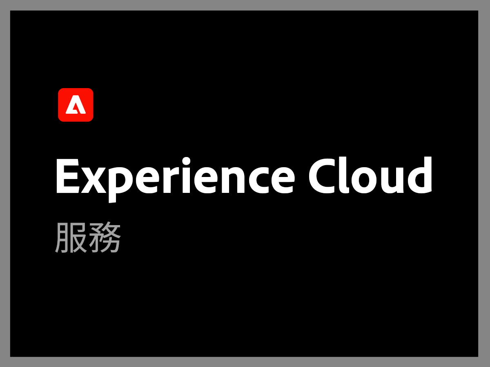
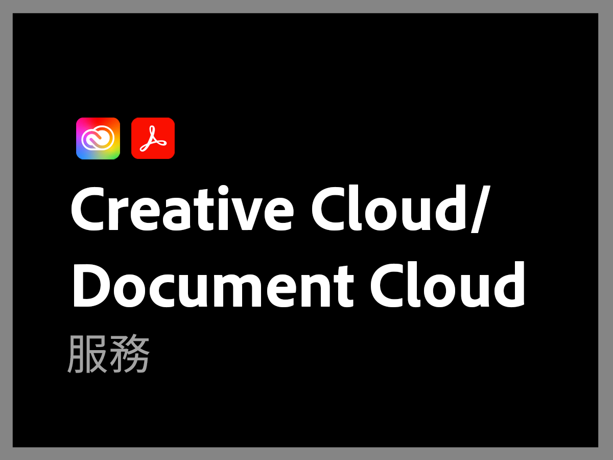

# 先前 Adobe 支援計劃概觀

>[!NOTE]
>
>此計劃是指 2022 年 6 月 16 日之前的 Adobe 支援計劃。 如需目前支援計劃，請參閱 [Adobe 支援產品概觀](overview.md)。

Adobe 支援組織致力於支援您的成功。 所有訂閱都包含某個支援等級，可讓您輕鬆存取我們的高技能技術資源，以獲得技術方面的協助。

為了滿足更全面的需求，我們提供了 Adobe 支援服務，其中包含聯繫指定的支援專業人員，以及主動式指導和服務審查的會議。 無論您的支援需求有多複雜，Adobe 都能提供您所需的技術和營運專業知識，以協助您從 Adobe 解決方案中獲得最佳效能和最大價值。

<table style="table-layout:fixed">
<tr>
  <td>
    
    

    <a href="dx-overview.md"><strong>Experience Cloud 支援</strong></a>
    

    
Experience Cloud 和 Experience Platform 產品支援選項

     
  </td>
  <td>
    
    

    <a href="dme-overview.md"><strong>Creative Cloud Enterprise 和文件支援</strong></a>
    

    
Document Cloud 和 Creative Cloud 產品支援選項

     
  </td>
</tr>
</table>
