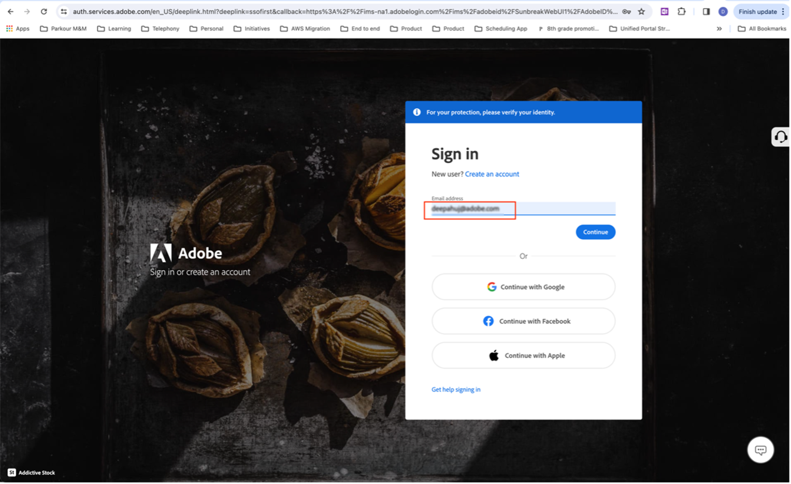
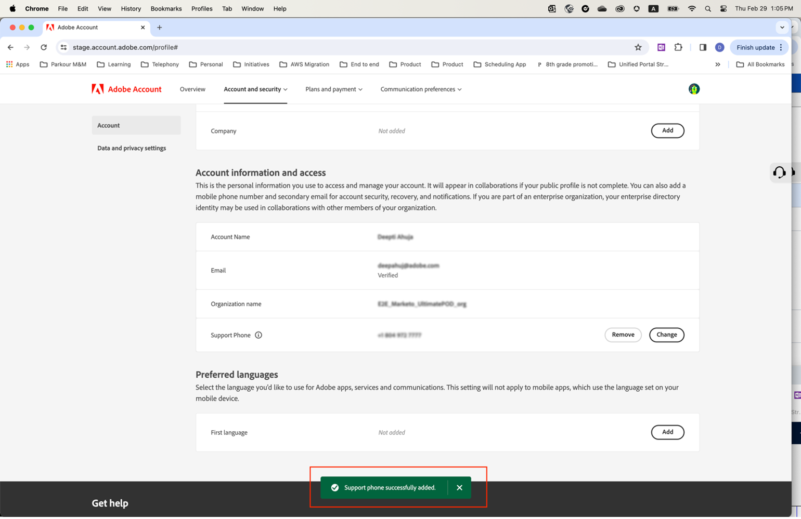

# 指定偏好的支援電話號碼

當您被指派為「管理員」角色（例如「產品支援管理員」）時，您應會收到一封電子郵件，通知您具有「管理員」許可權，可管理您已被授予管理員許可權的執行個體。

電子郵件現在包含下列紅色文字，說明如何前往您的帳戶設定檔，並與我們分享您偏好的支援電話號碼。

若要指定您偏好的電話號碼：

1. 按一下 **帳戶設定檔** 開啟新視窗以使用登入的連結 `account.adobe.com`.

   

1. 進行登入程式，然後如下所示的畫面登陸 `account.adobe.com`.
1. 然後按一下以下標籤「帳戶和安全性>帳戶」以檢視「支援電話號碼」欄位。
1. 在這裡新增電話號碼，以便我們識別您的支援需求。

